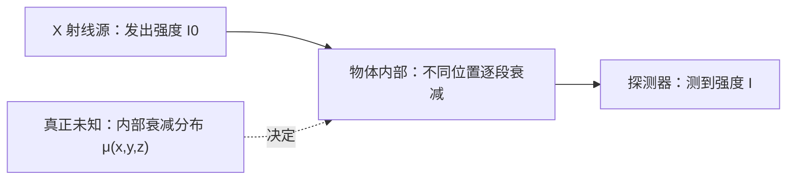
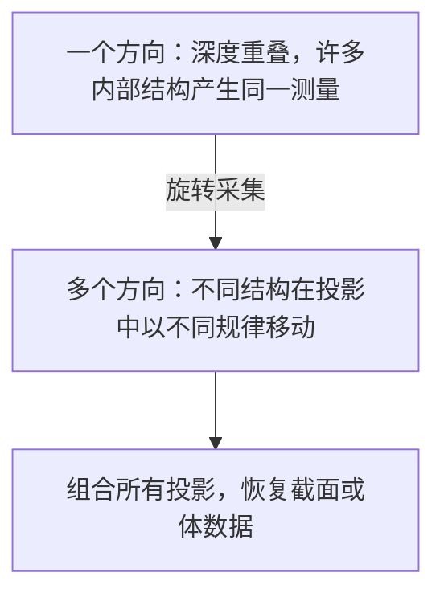

# CT 第 1 章：我们为什么能从外部测量物体内部

## 1. 从一个真实任务开始

设想面前有一个不能切开的金属零件。我们想知道它内部是否存在气孔、裂纹或者装配错误。最直接的方法当然是把它切开，但这样检测完成时零件也被破坏了。工业 CT 所做的工作，就是在不切开物体的情况下，估计它内部每个位置对 X 射线的衰减能力。

这句话里有两个不同世界。

第一个世界是我们真正想要的东西：物体内部的三维分布。可以把它记为

\[
\mu(x,y,z),
\]

其中 \(\mu\) 是线性衰减系数。它描述一小段材料会让通过它的 X 射线减弱多少。不同材料、不同密度和不同孔隙状态，会产生不同的 \(\mu\)。

第二个世界是设备实际能够测到的东西：X 射线源在物体一侧发光，探测器在另一侧记录到达的光子强度。探测器并不能伸进物体内部询问某一点的 \(\mu\)。它看到的是一条完整路径共同造成的结果。



所以 CT 的工作不是拍照后“增强一下图像”，而是一个逆向推断：

> 已知许多条射线穿过物体之后剩下多少强度，推断物体内部哪些位置造成了这些衰减。

经典教材通常也从这里开始。Kak 与 Slaney 的《Principles of Computerized Tomographic Imaging》先建立 line integral 和 projection，再讨论如何恢复截面，因为测量形式决定了后面所有重建算法。[教材在线版本](https://www.slaney.org/pct/)

## 2. 最直接的办法，以及它为什么不够

在讨论 CT 之前，先看一张普通 X 射线透视图。假设 X 射线从前向后穿过一个物体，探测器上的一个像素对应一条射线。射线经过骨骼、软组织或者金属之后，探测器记录一个最终强度。

这类图像非常有用，但它有一个根本限制：深度被压扁了。

假设同一条射线上有两个小孔。一个孔在物体前侧，另一个孔在后侧。只从这个方向测量时，它们对最终强度的影响叠加在一起。我们知道“这条路径总体衰减了多少”，却不知道衰减发生在路径的哪个位置。

可以用一个极简例子表示。物体只有前后两个区域，衰减系数分别为 \(\mu_1\) 和 \(\mu_2\)，两段长度都是 1。一次正面测量只能给出：

\[
p=\mu_1+\mu_2.
\]

如果测到 \(p=3\)，可能是：

\[
(\mu_1,\mu_2)=(1,2),
\]

也可能是：

\[
(\mu_1,\mu_2)=(0,3),
\]

还可能有无穷多组其他答案。

问题不在于测量噪声，而在于信息本身不够。一个方程无法唯一决定两个未知量。

这时最自然的改进是：换一个方向再测。旋转物体或者旋转 X 射线源和探测器，使不同射线以不同角度穿过内部。原来在同一条射线上的结构，换角度后会进入不同路径。随着方向增加，我们得到越来越多关于内部位置关系的约束。



“tomography”中的核心不是 X 射线本身，而是从多个方向的投影恢复截面。CT 中的 computerized 表示这种恢复由计算完成。

但在进入恢复算法前，我们还缺少一个关键问题：探测器读数和内部衰减之间究竟是什么关系？

## 3. 关键想法是怎样被引出来的

先考虑一束强度为 \(I_0\) 的 X 射线，穿过一小段均匀材料。实验上可以观察到，材料越厚，透过的强度越低；而且相同厚度的材料连续叠加时，衰减效果是相乘的。

如果一层材料让强度保留 80%，再经过同样一层，强度不是减去固定数值，而是再乘 80%：

\[
I_0
\longrightarrow 0.8I_0
\longrightarrow 0.8^2I_0.
\]

这类“每增加一点路径，就按当前强度继续衰减”的过程自然产生指数关系。对均匀材料：

\[
I=I_0e^{-\mu L},
\]

其中 \(L\) 是路径长度，\(\mu\) 是材料的线性衰减系数。

真实物体并不均匀。沿一条射线走过物体时，每个位置可能有不同的 \(\mu\)。可以把路径切成很多小段：

\[
I
=I_0
\exp(-\mu_1\Delta l_1)
\exp(-\mu_2\Delta l_2)
\cdots.
\]

指数相乘可以合并为指数内部相加：

\[
I
=I_0
\exp\left(
-\sum_j\mu_j\Delta l_j
\right).
\]

当小段越来越细，求和变成沿射线的积分：

\[
I
=
I_0
\exp\left(
-\int_{\ell}\mu(\mathbf r)\,d\mathbf r
\right).
\]

这就是理想单能情况下的 Beer-Lambert 模型。

现在出现了一个非常重要的转折。设备测到的是指数形式的强度 \(I\)，而我们希望内部不同位置的贡献能够相加。对强度做负对数：

\[
p
=-\log\frac{I}{I_0}
=\int_{\ell}\mu(\mathbf r)\,d\mathbf r.
\]

于是，一条射线的复杂乘性衰减被转成了沿路径的线性累加。这里的 \(p\) 通常称为线积分数据。

这不是为了让公式漂亮而进行的变换。它把“多个材料连续相乘的衰减”变成“多个空间位置贡献相加”，从而使重建问题能够使用线性代数和积分变换处理。

一个角度下所有 detector pixel 的线积分排列在一起，就形成一个 projection。不断旋转并记录 projection，便得到重建所需的投影数据。

## 4. 一步一步建立正式模型

### 从连续物体到投影函数

为了先看清结构，考虑二维截面 \(f(x,y)\)。一条射线可以由角度 \(\theta\) 和它到原点的有符号距离 \(s\) 表示：

\[
x\cos\theta+y\sin\theta=s.
\]

沿这条直线积分，得到：

\[
p(\theta,s)
=
\int_{\mathbb R^2}
f(x,y)
\delta(x\cos\theta+y\sin\theta-s)
\,dx\,dy.
\]

这个映射称为 Radon transform。暂时不必把注意力放在 \(\delta\) 函数上。它的作用只是“只选择位于指定直线上的点”。真正重要的是：

\[
\text{一条投影数据}
=
\text{物体在一条路径上的总衰减}.
\]

当 \(\theta\) 固定、\(s\) 沿 detector 改变时，我们得到一个角度的完整投影。让 \(\theta\) 改变，就得到许多方向的投影。

### 为什么计算机需要离散化

真实计算机不能保存连续函数 \(f(x,y)\)。我们把截面划分成 \(n\) 个 pixel 或把三维空间划分成 voxel，并把所有未知衰减系数写成向量：

\[
x=
\begin{bmatrix}
x_1&x_2&\cdots&x_n
\end{bmatrix}^{\mathsf T}.
\]

同时，把所有角度、所有 detector pixel 的测量排成向量：

\[
y=
\begin{bmatrix}
y_1&y_2&\cdots&y_m
\end{bmatrix}^{\mathsf T}.
\]

第 \(i\) 条射线经过第 \(j\) 个 voxel 的长度或插值权重记为 \(a_{ij}\)。于是第 \(i\) 条测量近似为：

\[
y_i
=
\sum_{j=1}^{n}a_{ij}x_j.
\]

把所有射线写在一起：

\[
y=Ax.
\]

这里的 \(A\) 不是一个随意引入的神秘矩阵。它只是把三件实际事实整理在一起：

1. 扫描仪从哪里发出射线；
2. detector pixel 位于哪里；
3. 每条射线穿过了哪些 voxel，以及穿过多少。

因此 \(A\) 同时包含采集几何和离散化方法。

### 为什么实际代码通常看不到矩阵

工业 CT 体数据可能包含数亿 voxel，投影也可能包含数亿测量。显式保存 \(A\) 几乎不现实，因为大部分元素虽然为零，非零元素数量仍然巨大。

程序通常只实现一个操作：

\[
x\longmapsto Ax.
\]

也就是给定体数据，模拟每条射线会得到什么测量。这个操作称为 forward projection。

现在重建任务可以写得非常清楚：

> 已知扫描几何 \(A\) 和测量 \(y\)，寻找一个内部体数据 \(x\)，使它产生的模拟投影 \(Ax\) 与真实投影接近。

最直接的数据误差是：

\[
D(x)
=
\frac12\|Ax-y\|_2^2.
\]

如果当前 \(x\) 产生的投影不对，我们要修改哪些 voxel？这就自然引出反投影和伴随算子。

### 伴随不是从天上掉下来的

设当前投影残差为：

\[
r=Ax-y.
\]

第 \(i\) 条射线误差很大，说明这条射线经过的 voxel 组合需要调整。一个 voxel 若被多条高误差射线经过，就应同时接收这些射线的影响。

按照前向投影中的相同权重把残差返回：

\[
g_j
=
\sum_{i=1}^{m}a_{ij}r_i.
\]

写成矩阵：

\[
g=A^{\mathsf T}r.
\]

这就是离散欧氏内积下的伴随反投影。它不是直接恢复图像，而是把测量空间中的误差信息返回未知量空间。

为什么这个返回方向有意义？对数据误差求梯度：

\[
\nabla D(x)
=
A^{\mathsf T}(Ax-y).
\]

因此，最基本的梯度下降更新是：

\[
x^{k+1}
=
x^k-\tau A^{\mathsf T}(Ax^k-y).
\]

逻辑链到这里闭合：

```text
内部体数据 x
→ 前向投影 Ax
→ 与真实测量 y 比较
→ 得到残差 r
→ 用 Aᵀ 把残差返回体空间
→ 修改 x
```

## 5. 跟着一个完整例子走到底

考虑一个只有三个 voxel 的一维物体：

```text
[ x1 ][ x2 ][ x3 ]
```

扫描仪取得两条不同路径：

- 射线 1 穿过 \(x_1\) 和 \(x_2\)；
- 射线 2 穿过 \(x_2\) 和 \(x_3\)。

假设穿过长度都归一化为 1，则：

\[
A=
\begin{bmatrix}
1&1&0\\
0&1&1
\end{bmatrix}.
\]

真实物体为：

\[
x_{\rm true}
=
\begin{bmatrix}
1\\2\\1
\end{bmatrix}.
\]

设备得到的理想线积分是：

\[
y
=Ax_{\rm true}
=
\begin{bmatrix}
3\\3
\end{bmatrix}.
\]

现在假设我们完全不知道内部，从零开始：

\[
x^0=
\begin{bmatrix}
0\\0\\0
\end{bmatrix}.
\]

第一步先问：当前猜测会产生怎样的投影？

\[
Ax^0
=
\begin{bmatrix}
0\\0
\end{bmatrix}.
\]

与真实测量比较：

\[
r^0
=Ax^0-y
=
\begin{bmatrix}
-3\\-3
\end{bmatrix}.
\]

两条射线都预测得太低。现在把误差沿原来的射线关系返回：

\[
A^{\mathsf T}r^0
=
\begin{bmatrix}
1&0\\
1&1\\
0&1
\end{bmatrix}
\begin{bmatrix}
-3\\-3
\end{bmatrix}
=
\begin{bmatrix}
-3\\-6\\-3
\end{bmatrix}.
\]

为什么中间 voxel 得到 \(-6\)？因为它同时影响两条低估的射线。两边 voxel 各只影响一条。

取步长 \(\tau=0.25\)：

\[
x^1
=x^0-\tau A^{\mathsf T}r^0
=
\begin{bmatrix}
0.75\\1.5\\0.75
\end{bmatrix}.
\]

再次投影：

\[
Ax^1
=
\begin{bmatrix}
2.25\\2.25
\end{bmatrix}.
\]

新的残差是：

\[
r^1
=
\begin{bmatrix}
-0.75\\-0.75
\end{bmatrix}.
\]

误差已经明显减小。

这个例子也暴露了下一层问题：两条射线不足以唯一确定三个未知量。真实 CT 需要大量角度和 detector pixel，但即使测量很多，噪声、不完整角度、有限分辨率和模型失配仍会让逆问题不稳定。后续的解析重建、迭代重建和正则化，都是在处理这些更深的问题。

## 6. 回到真实系统：程序实际上怎样工作

在真实 cone-beam CT 中，一条射线由 source position 和 detector pixel position 决定。forward projector 对每条射线完成：

```text
找到射线进入和离开重建体的位置
→ 确定它经过哪些 voxel 或采样点
→ 按路径长度或插值权重累积 μ
→ 写入对应 detector pixel
```

不同投影器用不同方式近似连续线积分：

- ray-driven 方法沿射线寻找 voxel；
- voxel-driven 方法把 voxel 投到 detector；
- distance-driven 方法匹配 voxel 和 detector footprint；
- texture-sampling 方法沿射线采样三线性插值体。

它们都可以近似同一个连续物理过程，但产生的离散矩阵 \(A\) 并不完全相同。因此反投影器必须匹配实际离散实现，而不只是匹配同一张几何示意图。

工程上建议将算子层明确写成：

```text
ProjectionGeometry
├─ source positions
├─ detector origins
├─ detector basis u, v
├─ detector spacing
├─ voxel spacing
└─ world-volume transform

Projector
├─ forward(volume, geometry)
└─ adjoint(projection, geometry)
```

如何确认 `adjoint` 确实匹配 `forward`？利用伴随的定义：

\[
\langle Ax,r\rangle
=
\langle x,A^\ast r\rangle.
\]

随机生成一个体数据 \(x\) 和投影数据 \(r\)，分别计算左右两边。若坐标尺度、权重、边界处理或 detector 翻转不一致，两边就会出现明显差异。

这个测试只证明两个程序彼此匹配，不证明真实物理已经完整。实际设备还存在多能谱、散射、探测器响应、焦点尺寸和几何标定误差。我们先建立理想模型，是为了获得一个可验证的基准；后面再逐项放宽假设。

## 7. 容易走错的岔路

最常见的第一个误解是把反投影当成逆变换。这个想法很自然：既然 projection 把体数据变成投影，backprojection 似乎应该把投影变回体数据。但 \(A^{\mathsf T}\) 只是把测量贡献返回，它没有消除不同射线覆盖造成的模糊。直接对投影反投影，通常得到的是一个被扩散的结果，而不是精确重建。

第二个误解是认为连续模型相同，离散实现就必然匹配。两个 kernel 都可能声称自己实现“线积分”和“反投影”，但如果一个使用路径长度、另一个使用三线性采样，它们对应的离散权重就不同。迭代算法会把这种不匹配当成重建误差的一部分。

第三个误解是认为投影越多就一定能得到完美答案。更多投影通常增加约束，但真实测量仍有噪声，采集角度可能不完整，而且有限 detector 和 voxel 分辨率会丢失高频信息。重建始终是在数据、模型和先验之间做判断。

第四个误解是过早把神经网络放到问题中心。如果网络前面的投影模型不正确，网络可能在训练数据上学会补偿某一种错误，却无法在新几何、新材料或新设备上保持一致。学习方法必须建立在明确的测量关系上。

## 8. 本章落点、验证与下一章

现在我们已经从工业检测任务走到了第一个完整数学模型。

最初的问题是不能切开零件，却想知道内部结构。X 射线只能给出一条路径的总衰减，单方向投影会丢失深度。旋转采集让不同路径提供更多约束。Beer-Lambert 定律解释了强度如何衰减，负对数把乘性衰减转成线积分。离散化之后，扫描过程成为 \(y=Ax\)。为了根据投影误差修改体数据，我们沿相同权重把残差返回，从而得到伴随 \(A^\ast\) 和梯度 \(A^\ast(Ax-y)\)。

在 CT Framework 中，这一章对应 projector、backprojector 和统一几何定义。在 CTGS 中，规则体素 \(x\) 会被 Gaussian 参数替换，但“根据成像模型产生预测，再把测量误差传回参数”的故事完全保留。

本章的 60 分钟验证是：

1. 找到项目中的 forward projector 和 backprojector；
2. 随机生成小体数据 \(x\) 与随机投影 \(r\)；
3. 计算 \(\langle Ax,r\rangle\)；
4. 计算 \(\langle x,A^\ast r\rangle\)；
5. 比较二者，并分别修改 voxel spacing、detector offset 和 detector 水平朝向观察误差。

预期不是得到一张漂亮图，而是能够解释：哪一个几何或尺度改变破坏了两个算子的配对。

下一章会从一个新的自然问题开始：既然简单反投影会把每条射线的值沿路径扩散，为什么在反投影之前加入一个特殊滤波器，就能恢复清晰截面？这将把我们带到 Fourier Slice Theorem、ramp filter 和 FBP；随后再扩展到 cone-beam 几何中的 FDK。

