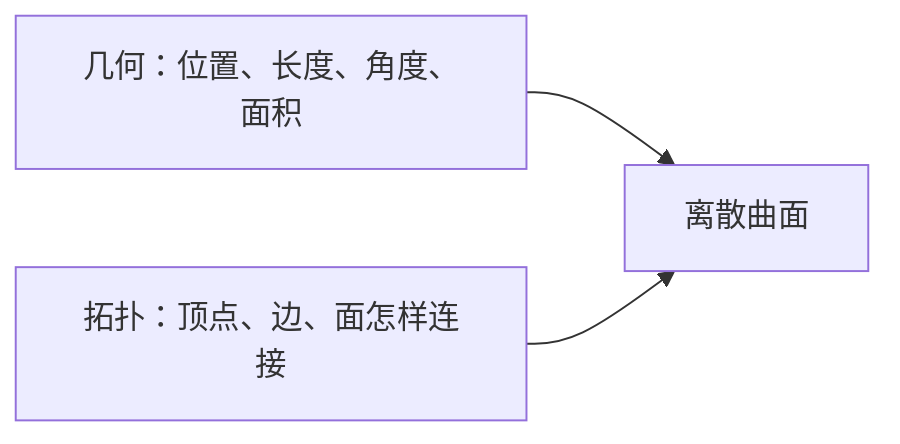
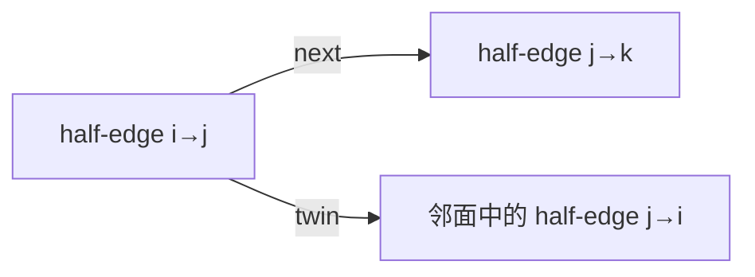

# 几何处理第 1 章：为什么一堆三角形还不是一张可以处理的曲面

## 1. 从一个真实任务开始

假设 CT 分割完成后，我们用 Marching Cubes 得到一个 STL。查看器能够把它画出来，看上去也是一个完整零件。接下来我们想做的事情却不再只是“显示”：希望平滑表面、删除噪声小块、修补孔洞、计算曲率、简化三角形，最后再做布尔运算。

这些操作有一个共同前提：程序不仅要知道每个三角形在哪里，还必须知道三角形之间怎样连接。

渲染器处理一个三角形时，只需要三个顶点坐标和一些属性。几何处理算法却会问：

- 这条边的另一侧是哪一个三角形？
- 一个顶点周围有哪些相邻顶点？
- 这里是内部边还是边界？
- 绕这个顶点走一圈，能否回到起点？
- 这组面共同组成一个外壳，还是若干互相重叠的碎片？

因此，几何处理的起点不是某一种平滑公式，而是先把“能画出来的三角形集合”变成“具有可信连接关系的离散曲面”。

经典的网格处理教材也从表面表示、数据结构和基本性质进入，再继续讲平滑、参数化、简化与重网格化。原因不是数据结构比算法更高级，而是后面的算法必须依赖可靠邻接。[Polygon Mesh Processing 书目信息](https://publications.rwth-aachen.de/record/96844/)

## 2. 最直接的办法，以及它为什么不够

STL 最直接的表达方式是逐个保存三角形。每个三角形都有三个坐标：

```text
triangle 1: A, B, C
triangle 2: B, A, D
```

人一眼可以看出两个三角形共享边 \(AB\)。但文件中第二个三角形的 `B` 可能只是一个数值相同的新坐标，并没有指针指向第一个三角形的 `B`。对 STL 来说，它们只是六条坐标记录。

这种表示称为 triangle soup。它非常适合交换和渲染，因为每个三角形可以独立处理。问题在我们尝试修改曲面时出现。

假设要把一个顶点移动到相邻顶点的平均位置。若程序不知道哪些三角形共享这个顶点，它只能分别移动每份坐标副本。只要某一份遗漏，原本视觉上闭合的表面就会裂开。再比如判断孔洞，需要找到只属于一个三角形的边；如果没有边的身份，也就无从判断“这条边被使用了几次”。

最直接的补救是：坐标一样的点都合并成一个顶点。可这又产生新问题。两个坐标非常接近的点可能确实是扫描噪声造成的重复，也可能是一个极薄结构的两侧。容差太小，裂缝保留；容差太大，薄壁被粘在一起，物体拓扑被改变。

所以我们不能只把网格理解成坐标。必须把两类信息分开：



## 3. 关键想法是怎样被引出来的

想象用许多三角形布片缝成一个橡胶表面。每块布片的形状和空间位置属于几何；哪些边被缝在一起属于拓扑。

只拉动布片而不拆线，几何改变、拓扑不变。剪开一条缝或把两个边界缝起来，哪怕顶点暂时还在原位置，拓扑也已经改变。

这一区分解决了前面的混乱：

- “两个点坐标是否接近”是几何问题；
- “两个三角形是否共享同一顶点”是拓扑问题；
- 焊接是根据几何证据做出的拓扑修改；
- 修改后必须重新检查曲面是否合法。

把网格写成

\[
\mathcal M=(V,E,F)
\]

时，\(V\)、\(E\)、\(F\) 首先表示抽象的顶点、边和面。每个顶点再通过一个映射获得空间位置：

\[
\mathbf p:V\rightarrow\mathbb R^3.
\]

同一个 \((V,E,F)\) 可以被放到不同坐标中；同一批坐标也可以用不同连接方式组成不同曲面。这个看似形式化的区分，正是平滑、简化和布尔运算能够被可靠定义的基础。

## 4. 一步一步建立正式模型

先从最简单的 indexed mesh 开始。我们建立一个不重复的顶点数组：

```text
positions: p0, p1, p2, p3, ...
```

三角形不再保存三份坐标，而是保存索引：

```text
faces: (0, 1, 2), (1, 0, 3), ...
```

现在两个面引用同一索引时，它们才真正共享顶点。

接着需要恢复边。一个三角形 `(i,j,k)` 产生三条无向边：

\[
\{i,j\},\quad\{j,k\},\quad\{k,i\}.
\]

程序可以用规范键

\[
(\min(i,j),\max(i,j))
\]

统计每条边被哪些面使用。

对于通常希望处理的二维流形曲面：

- 内部边恰好属于两个面；
- 边界边属于一个面；
- 超过两个面共享同一边时，该边非流形。

但边检查还不够。若两个独立的三角形扇只在一个顶点相碰，每条边都可能只属于一或两个面，顶点邻域却不是一个圆盘。正确的顶点邻域应该是：

- 内部顶点周围形成一个闭合环；
- 边界顶点周围形成一条连续链；
- 不能分成两个互不连接的面扇。

为了高效回答这些邻接问题，几何处理常使用 half-edge。每条无向边被拆成两个有方向的 half-edge，每个 half-edge 记录：

```text
起点 vertex
所属 face
同一 face 中的下一个 half-edge
反方向 twin half-edge
```

`next` 让我们沿一个三角形走，`twin` 让我们跨过共享边进入相邻三角形。组合二者，就能绕顶点遍历一环邻域。



朝向也从这里自然出现。若一个面沿共享边使用 \(i\rightarrow j\)，相邻面应使用 \(j\rightarrow i\)。否则两个面的局部方向不一致。对闭合可定向曲面，我们可以从一个面开始，通过邻接传播，使整个连通分量方向一致。

最后可以用 Euler 特征做总体检查：

\[
\chi=|V|-|E|+|F|.
\]

对连通、闭合、可定向曲面：

\[
\chi=2-2g,
\]

其中 \(g\) 是 genus。它不能证明网格完全正确，但能发现某些操作是否意外改变孔洞结构。

## 5. 跟着一个完整例子走到底

考虑四个顶点组成的四面体。四个有向三角形为：

```text
(0, 2, 1)
(0, 1, 3)
(1, 2, 3)
(2, 0, 3)
```

第一步，从每个三角形提取无向边。去重后得到六条：

```text
{0,1}, {0,2}, {0,3}, {1,2}, {1,3}, {2,3}
```

每条边都被两个面使用，所以没有边界边，也没有关联超过两个面的边。

第二步检查方向。以边 `{0,1}` 为例，第一个相关面 `(0,2,1)` 沿边使用 \(1\rightarrow0\)，第二个相关面 `(0,1,3)` 使用 \(0\rightarrow1\)，方向相反，符合一致曲面要求。其余边也一样。

第三步计算 Euler 特征：

\[
|V|=4,\qquad |E|=6,\qquad |F|=4,
\]

\[
\chi=4-6+4=2.
\]

这与 genus \(g=0\) 的闭合球面型拓扑一致。

现在删除面 `(2,0,3)`。原来属于它的三条边各只剩一个关联面，于是出现一个三角形边界环。曲面不再 watertight。它仍然可以被渲染，但 signed volume、实体布尔和可靠内外判断都失去了前提。

再考虑复制面 `(0,1,3)`。视觉上它与原面完全重合，渲染结果可能几乎不变；边表却会发现三条边的面关联数量异常。这正说明显示正确和拓扑正确是两件事。

## 6. 回到真实系统：程序实际上怎样工作

STL 导入不应该一步直接变成“有效曲面”。更可靠的流程是保留每次推断：

```text
RawTriangleSoup
→ 坐标候选焊接
→ IndexedMesh
→ 建立边与 half-edge
→ 检查边界、非流形和朝向
→ ValidatedSurface
```

候选焊接可以使用空间哈希。先根据模型包围盒选择尺度相关的 cell size，把邻近坐标放入同一或相邻桶，再进行精确距离判断。每次合并后都要检查是否产生零长度边或零面积面，因为一个几何上合理的“靠近”可能造成拓扑折叠。

诊断结果应该显式保存：

```text
原始三角形数
焊接前后顶点数
零面积面数
重复面数
边界边数
非流形边数
连通分量数
朝向翻转数
```

后续算法再声明自己的输入要求。例如 Laplacian smoothing 可以允许边界，但需要可靠一环邻域；实体布尔通常需要一致朝向和明确内外；渲染只需要三角形索引，却不保证任何拓扑性质。

这种分层也解释了为什么 DirectX 渲染数据和几何处理数据不必使用同一结构。GPU 适合紧凑 vertex/index buffer；CPU 几何内核更需要 half-edge 和邻接。二者可以由同一个已验证曲面生成，而不是强迫一种结构承担所有职责。

## 7. 容易走错的岔路

“坐标相同就一定是同一顶点”看似合理，因为真实物体的同一点当然只有一个位置。但文件格式可能为了法线、UV seam、材料边界或独立壳层而重复位置。是否合并是拓扑决定，不只是浮点比较。

“每条边最多两个面就是流形”也不完整。蝴蝶结顶点的边统计可能正常，但顶点周围有两个独立面扇。算法绕顶点遍历时会发现邻域断裂。

“把焊接容差调大就能修更多裂缝”是最危险的捷径。它会在没有语义判断的情况下把薄壁、近接触面和小孔直接粘死。表面看起来更闭合，真实几何却被改变。

“能在查看器里正常显示就是有效 STL”只适用于渲染目标。光栅器会忠实画出重复面、裂缝和非流形结构，却不会告诉我们这些结构无法支持曲率、布尔或参数化。

## 8. 本章落点、验证与下一章

本章从 CT 表面需要进一步处理这一真实任务出发，解释了为什么 triangle soup 只够显示、不够处理。关键抽象是把几何坐标和拓扑连接分开，再通过 indexed mesh、边表和 half-edge 恢复一张可遍历曲面。

对 STL/DirectX 项目，导入器应该同时产生渲染 buffer 和 `MeshDiagnostics`。对 CT 表面提取，平滑和简化之前应先检查边界、连通分量和非流形结构。对 CTGS-to-mesh，Chamfer distance 只能描述几何接近，不能替代拓扑检查。

本章的 60 分钟验证是：读取一个 STL，先只构建 indexed mesh 和无向边表，输出边界边、非流形边、连通分量和 Euler 特征；然后手动删除一个三角形，观察边界环怎样出现。预期结果是你能从数据结构解释变化，而不是只看到模型“缺了一块”。

下一章会自然追问：一旦我们能够取得每个顶点的一环邻域，怎样把连续曲面上的梯度、散度和曲率翻译到离散网格？这将引出 graph Laplacian、cotangent Laplacian，以及它们为什么会产生不同的平滑行为。

