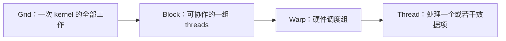

# AI Infrastructure 第 1 章：GPU 为什么快，以及训练为什么仍然会慢

## 1. 从一个真实任务开始

训练 CTGS 时，一次迭代需要投影大量高斯、计算损失、反向传播并更新参数。换上理论算力更高的 GPU 后，我们自然期待训练近似按 TFLOP/s 比例加速。实际情况经常不是这样：GPU utilization 看起来很高，kernel 也一直在运行，但每秒处理的视角数并没有明显增加。

这就是 AI Infrastructure 要处理的工作。它不重新发明网络结构，而是让一个已经定义好的训练任务在真实硬件上稳定、高效、可扩展地执行。

要理解训练系统，必须先理解 GPU 被设计来解决什么问题。CPU 擅长让少量复杂任务尽快完成：它拥有复杂控制、较大的缓存和强大的单线程能力。GPU 最初服务于图形渲染，需要对大量顶点和像素执行相似计算，于是把更多芯片面积用于并行算术和吞吐。

所以 GPU 的优势不是“每个核心都比 CPU 核心快”，而是：

> 当一个问题可以被拆成大量相似工作，并且有足够数据持续供应时，GPU 能让许多工作同时处于执行或等待状态，从而获得很高总吞吐。

NVIDIA 官方 CUDA Programming Guide 也从可扩展的并行程序模型开始：kernel 被分成 thread、block 和 grid，block 被分配到 SM，线程访问分层内存。[CUDA Programming Guide](https://docs.nvidia.com/cuda/cuda-c-programming-guide/index.html)

## 2. 最直接的办法，以及它为什么不够

假设我们要对一亿个数执行：

\[
y_i=2x_i+1.
\]

在 CPU 上写一个循环非常直接：

```cpp
for (int i = 0; i < N; ++i)
    y[i] = 2 * x[i] + 1;
```

由于每个元素互不依赖，看起来只要给每个元素一个 GPU thread 就结束了。数学上确实如此，但性能问题马上出现。

每个元素只做一次乘法和一次加法，却要从显存读取 `x[i]`，再把 `y[i]` 写回显存。算术只花很少工作，数据却必须经过相对遥远的存储系统。如果显存来不及供数，大量计算单元就会等待。

另一个问题是任务颗粒度。若只有几百个元素，CPU 启动 GPU kernel、驱动提交命令和 GPU 调度的固定成本，可能比计算本身还大。GPU 有很多执行资源，并不意味着任何规模的问题都值得交给它。

第三个问题是线程并非完全独立地在硬件上执行。程序写的是 thread，硬件却把相邻线程组成 warp 调度。如果同一个 warp 中一半线程走 `if` 分支，另一半走 `else`，两条路径通常不能像两个独立 CPU core 那样同时自由前进。

因此“每个元素一个 thread”只是正确性映射，还不是性能模型。我们需要知道线程怎样被组织、数据从哪里来，以及硬件用什么方式隐藏等待。

## 3. 关键想法是怎样被引出来的

GPU 没有试图消除每一次显存访问的高延迟。它采用了另一种策略：当一组线程等待数据时，快速切换去执行另一组已经准备好的线程。

为了让这种策略成立，程序必须同时提供很多工作。CUDA 把工作分成三个层次：



block 是程序模型中的协作边界。同一 block 的线程可以使用 shared memory，并能进行 block 内同步。硬件把 block 放到某个 Streaming Multiprocessor，也就是 SM 上执行。block 内线程再被组成 warp；NVIDIA GPU 中通常每个 warp 有 32 个线程。

这套层次解决了两个不同问题：

- grid/block 让程序能随着 SM 数量变化而扩展；
- warp 让硬件用统一指令高效驱动许多数据通道。

与此同时，GPU 提供多级存储。每个 thread 有 register，block 有 shared memory，整个 device 有 global memory。越靠近执行单元，容量通常越小、访问越快；越远，容量越大、代价越高。

于是 GPU 性能的核心故事不再只是“并行做多少计算”，而变成：

> 怎样让数据在靠近计算的位置被重复利用，同时保持足够多的 warp，覆盖无法避免的等待时间？

## 4. 一步一步建立正式模型

先看一个 warp。若 32 个 thread 都执行：

```cpp
y[i] = 2 * x[i] + 1;
```

硬件可以对 32 个不同的 `i` 发出相同指令。这就是 SIMT：single instruction, multiple threads。每个 thread 有自己的寄存器和索引，但共同执行同一条指令流。

如果代码变成：

```cpp
if (x[i] > 0)
    y[i] = expensive_a(x[i]);
else
    y[i] = expensive_b(x[i]);
```

当 warp 内线程选择不同分支时，硬件需要分别执行被选择的路径，并暂时屏蔽另一组线程。这个现象称为 divergence。问题不在于 `if` 本身，而在于同一个 warp 内是否发生不同控制流。

接着看内存。若相邻线程访问相邻地址：

```text
thread 0 → x[0]
thread 1 → x[1]
...
thread 31 → x[31]
```

硬件能够把请求合并成较少的内存事务。若每个 thread 按大步长跳跃，warp 会触发更多事务，传输了许多不需要的数据。这就是 coalescing 为什么重要。

现在需要一个定量方法判断程序究竟缺算力还是缺带宽。定义算术强度：

\[
I=
\frac{\text{执行的浮点运算数}}
{\text{从主要内存移动的字节数}}.
\]

设 GPU 峰值算力为 \(P_{\max}\)，显存带宽为 \(B_{\max}\)，程序可达到的性能受近似上界约束：

\[
P\le
\min(P_{\max},B_{\max}I).
\]

这就是 Roofline 思想。

仍看

\[
y_i=2x_i+1.
\]

float32 下，每个元素至少读取 4 bytes、写入 4 bytes，只做大约 2 FLOPs：

\[
I\approx\frac{2}{8}=0.25\ {\rm FLOP/byte}.
\]

假设显存带宽为 \(1000\ {\rm GB/s}\)，由带宽给出的上界约为：

\[
1000\times0.25=250\ {\rm GFLOP/s}.
\]

即使 GPU 理论峰值有几十 TFLOP/s，这个算子也没有足够计算去利用它。瓶颈是搬运，不是乘加单元。

这也解释了 occupancy。occupancy 表示 SM 上活跃 warp 相对于硬件容量的比例。较多 warp 可以隐藏等待，但 occupancy 不是最终目标。若为了提高 occupancy 强行减少 register，导致数据 spill 到更慢的内存，总性能反而可能下降。

## 5. 跟着一个完整例子走到底

考虑训练图中的三个逐元素操作：

\[
t_1=x+\alpha,
\]

\[
t_2=\max(t_1,0),
\]

\[
y=\beta t_2.
\]

在 eager 执行中，它们可能对应三个 kernel。

第一个 kernel 读取 \(x\)，写出 \(t_1\)。第二个读取 \(t_1\)，写出 \(t_2\)。第三个读取 \(t_2\)，写出 \(y\)。对 \(N\) 个 float32 元素，忽略常数后，显存流量约为：

\[
3\times(4N+4N)=24N\ {\rm bytes}.
\]

而且 CPU 需要提交三次 kernel。

如果编译器把它们融合成一个 kernel，每个 thread 可以在 register 中连续完成三步：

```text
读取 x[i]
→ 加 alpha
→ ReLU
→ 乘 beta
→ 写出 y[i]
```

中间结果不再写回 global memory，总流量约为：

\[
4N+4N=8N\ {\rm bytes}.
\]

FLOP 数几乎没有变化，速度却可能显著提高，因为数据移动减少到三分之一，launch 也从三次变成一次。

现在再考虑矩阵乘。矩阵中的一个元素会参与许多乘加。如果每次都从 global memory 重新读取，带宽仍会成为瓶颈。高性能 GEMM 让一个 block 把矩阵 tile 搬入 shared memory，再让多个 thread 重复使用。数据移动次数下降，算术强度上升，Tensor Core 才有机会持续工作。

这两个例子共同说明：优化 AI 系统不是把所有代码都改成更复杂的 CUDA，而是识别数据在哪一层被重复移动，并重新组织计算以增加复用。

## 6. 回到真实系统：程序实际上怎样工作

一次 PyTorch 训练迭代大致经历：

```text
Python/CPU 准备操作
→ dispatcher 选择算子实现
→ 向 CUDA stream 提交 kernels
→ kernels 在 SM 上执行
→ 中间 tensor 保存在 device memory
→ backward 再读取保存的激活
→ optimizer 更新参数
```

端到端变慢可能发生在任何一层：

- CPU 生成太多小操作，GPU 队列中出现空洞；
- tensor 太小，kernel 没有足够 blocks 填满 GPU；
- kernel 访存不连续；
- 大量逐元素算子反复读写中间结果；
- backward 保存过多激活，显存压力导致更小 batch；
- 动态 shape 阻止编译器稳定融合；
- 多 GPU 等待通信。

因此分析顺序应从时间线开始，而不是先猜某个 kernel 写得不好：

1. GPU 时间线上是否持续有工作？
2. 时间集中在哪些 kernel？
3. 这些 kernel 的数据规模和 shape 是什么？
4. 它们接近带宽上限还是计算上限？
5. 相邻 kernel 是否通过大中间 tensor 连接？
6. 优化后端到端 step time 是否真的下降？

在 CTGS 中，Gaussian 数量会动态变化。一次迭代变慢可能只是高斯从 50 万增加到 100 万，也可能是 sorting、rasterization 或 optimizer state 更新效率下降。因此 profiler 记录必须同时包含 Gaussian count、视角分辨率、dtype、显存峰值和 step time。

## 7. 容易走错的岔路

看到 GPU utilization 接近 100%，很容易判断“GPU 已经被完全利用”。实际上它只表示采样期间 GPU 有活动，不能说明活动是否高效。大量低效访存 kernel 也能保持繁忙。

看到 occupancy 不高，又容易直接调大 block 或减少 register。occupancy 只是在等待发生时提供可切换工作；如果 kernel 已经达到计算或带宽上限，更高 occupancy 没有额外价值。

另一个常见误判是只比较 FLOP 数。两个图执行相同数学运算，却可能因为中间 tensor 数量不同而有完全不同的显存流量。对现代训练系统，数据移动和 kernel 边界与 FLOP 同样重要。

最后，`torch.compile`、CUDA Graphs 或 mixed precision 都不是通用加速按钮。它们分别针对图优化与融合、launch 重放、数据宽度与硬件路径。必须先确认瓶颈位于它们能够改变的部分。

## 8. 本章落点、验证与下一章

本章从“更高 TFLOP/s 为什么没有带来同比训练加速”开始，建立了 GPU 的基本故事：GPU 通过大量并行工作获得吞吐；warp 是硬件调度组；多级内存决定数据代价；大量 warp 用于隐藏等待；Roofline 用算术强度区分带宽和计算瓶颈；算子融合通过减少中间读写提高效率。

对 CTGS，本章直接对应 rasterization、sorting、逐元素 mask 和 optimizer 更新。对 CT projector，它对应射线访存、分支差异和反投影原子累加。对训练平台，它要求把 kernel 时间与 shape、dtype 和数据规模绑定。

本章的 45 分钟验证是：对一个大 tensor 运行

```python
y = torch.relu(x + 1.0) * 0.5
```

分别记录 eager 与 `torch.compile` 预热后的 kernel 数量和执行时间。预期不是简单得到“compile 更快”，而是从 profiler 观察：若发生融合，中间 tensor 读写和 launch 数量如何变化；若没有加速，瓶颈可能不在这条逐元素链。

下一章将把 Roofline 用到真实算子上。我们会估算 CT projector、Gaussian rasterizer 和矩阵乘的算术强度，再把估算与 profiler 的带宽、吞吐和 stall 指标对应起来。

