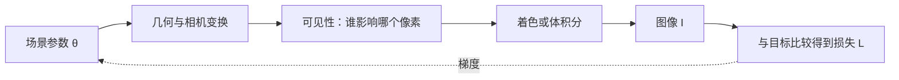

# 可微三维渲染第 1 章：从生成图像到反过来理解场景

## 1. 从一个真实任务开始

传统渲染器接收场景，输出图像。场景中已经给定相机、几何、材质和光源，程序的工作是计算它们最终在传感器上形成什么颜色：

\[
\text{scene}\longrightarrow\text{image}.
\]

但许多三维视觉任务面对的是相反情况。我们已经拍到一组图像，却不知道相机是否准确、表面在哪里、材料是什么，甚至不知道场景应该由 mesh、体密度还是高斯表示。我们想调整场景，让渲染结果逐渐接近真实照片：

\[
\text{images}\longrightarrow\text{scene}.
\]

这类任务称为 inverse rendering 或 inverse graphics。它不是简单地“把渲染倒放”，因为从三维场景到二维图像会丢失信息。不同几何、材质和光照可能生成相似像素。

可微渲染提供的是一条局部导航信息。若当前场景渲染得不对，它计算：

> 每个可优化参数发生一个很小变化时，图像和损失会怎样变化？

有了这个梯度，优化器就能反复修改场景。Mitsuba 的逆渲染教程也是从“渲染参考图像、定义图像误差、反向传播到场景参数、优化参数”这一闭环进入。[Mitsuba 3 inverse rendering tutorials](https://mitsuba.readthedocs.io/en/v3.5.2/src/inverse_rendering_tutorials.html)

## 2. 最直接的办法，以及它为什么不够

假设只有一个参数：物体在水平方向的位置 \(p\)。目标图像中物体偏右，而当前渲染偏左。最直接的办法是尝试许多位置：

```text
p - 0.1
p - 0.09
...
p + 0.09
p + 0.1
```

逐个渲染，选择误差最小的结果。一个参数时可以这样做；若场景有百万个高斯，每个高斯还有位置、尺度、旋转、密度和颜色，穷举就不可能。

另一种直接方法是数值差分。对每个参数 \(\theta_j\)，分别渲染：

\[
L(\theta_j+\varepsilon)
\quad\text{和}\quad
L(\theta_j-\varepsilon),
\]

再估计：

\[
\frac{\partial L}{\partial\theta_j}
\approx
\frac{L(\theta_j+\varepsilon)-L(\theta_j-\varepsilon)}
{2\varepsilon}.
\]

它的计算量随参数数量增长。百万参数意味着每次迭代需要数百万次额外渲染，而且 \(\varepsilon\) 太大或太小都会产生误差。

自动微分似乎解决了这个问题：只要把渲染写成计算图，就能一次 backward 得到所有参数梯度。可传统渲染中存在离散决定。例如 rasterizer 判断像素中心是否在三角形内；ray tracer 判断哪一个表面是最近交点。物体轻微移动但没有改变覆盖时，像素完全不变；一旦轮廓跨过像素，颜色突然跳变。

所以真正困难的不是乘法、矩阵变换和颜色混合。这些通常都能求导。困难在于可见性：

> 当参数改变时，谁被看见、谁被遮挡、哪个 primitive 影响哪个像素，可能离散地改变。

## 3. 关键想法是怎样被引出来的

把完整渲染拆开，就能看见问题位于哪里：



几何变换通常由矩阵乘法组成；材质、光照和体合成通常由连续函数组成。若可见性在局部不变，这些部分可以用链式法则连接。

于是可微渲染的关键想法不是要求“整个真实世界处处光滑”，而是：

1. 明确哪些参数需要优化；
2. 为连续部分计算准确导数；
3. 对可见性等不连续部分设计可用梯度估计；
4. 让前向模型仍然足够接近真实成像。

不同可微渲染方法之间的主要差异，也由此变得容易理解。

- soft rasterization 把硬覆盖变成连续概率；
- 体渲染把硬表面替换成连续密度；
- edge sampling 专门估计轮廓移动的贡献；
- Gaussian splatting 让 primitive 对一片像素有平滑 footprint；
- 一些方法前向使用硬决策，反向使用近似梯度。

它们都在回答同一个问题：怎样把像素误差可靠地传回场景参数。

## 4. 一步一步建立正式模型

把所有可优化场景参数记为：

\[
\theta=
\{\theta_{\rm camera},
\theta_{\rm geometry},
\theta_{\rm appearance},
\theta_{\rm lighting}\}.
\]

渲染器是函数：

\[
I=R(\theta).
\]

目标图像记为 \(I^\ast\)。最简单的图像损失是：

\[
L(\theta)
=
\frac12\|R(\theta)-I^\ast\|_2^2.
\]

优化器需要：

\[
\nabla_\theta L.
\]

根据链式法则：

\[
\frac{\partial L}{\partial\theta}
=
\frac{\partial L}{\partial I}
\frac{\partial I}{\partial\theta}.
\]

\(\partial I/\partial\theta\) 是渲染器的 Jacobian。它可能非常大，因为每个像素都可能依赖许多参数。反向模式自动微分不显式保存整个 Jacobian，而是从标量损失出发计算 vector-Jacobian product。

现在看一个连续的体渲染模型。沿相机射线 \(\mathbf r(t)\)，位置 \(t\) 处有密度 \(\sigma(t)\) 和颜色 \(c(t)\)。射线颜色为：

\[
C
=
\int_{t_n}^{t_f}
T(t)\sigma(t)c(t)\,dt,
\]

其中

\[
T(t)
=
\exp\left(
-\int_{t_n}^{t}\sigma(s)\,ds
\right)
\]

表示射线在到达 \(t\) 之前尚未被吸收的比例。

离散采样后：

\[
C
=
\sum_i T_i\alpha_i c_i,
\]

\[
\alpha_i=1-\exp(-\sigma_i\Delta_i),
\qquad
T_i=\prod_{j<i}(1-\alpha_j).
\]

这一串指数、乘法和加法都可求导。如果某个采样点颜色过亮，像素损失可以沿 \(T_i\alpha_i\) 返回颜色；也可以通过 \(\alpha_i\) 返回密度。

3D Gaussian Splatting 使用的是不同离散表示。一个高斯由中心 \(\mu\) 和协方差 \(\Sigma\) 定义：

\[
G(\mathbf x)
=
\exp\left[
-\frac12(\mathbf x-\mu)^{\mathsf T}
\Sigma^{-1}
(\mathbf x-\mu)
\right].
\]

它投影到屏幕后形成二维椭圆，而不是一个只有“覆盖/不覆盖”的理想点。椭圆 footprint 让位置和尺度的小变化可以连续改变邻近像素，从而产生梯度。

但高斯方法仍不是处处光滑。深度排序交换、tile culling、densification 和 pruning 都包含离散变化。可微表示减轻了可见性问题，没有消灭它。

## 5. 跟着一个完整例子走到底

考虑一个一维 detector sample，位置为 \(u\)。场景中只有一个高斯，中心为 \(\mu\)、宽度为 \(\sigma\)、幅值为 \(a\)。它在 detector 上的预测为：

\[
\hat y(\mu)
=
a\exp\left[
-\frac{(u-\mu)^2}{2\sigma^2}
\right].
\]

目标测量为 \(y^\ast\)，损失为：

\[
L(\mu)
=
\frac12(\hat y-y^\ast)^2.
\]

先问高斯中心移动时，预测怎样变化。对 \(\mu\) 求导：

\[
\frac{\partial\hat y}{\partial\mu}
=
\hat y\frac{u-\mu}{\sigma^2}.
\]

再把图像误差接上：

\[
\frac{\partial L}{\partial\mu}
=
(\hat y-y^\ast)
\hat y
\frac{u-\mu}{\sigma^2}.
\]

假设 sample 在高斯右侧，即 \(u>\mu\)，当前预测又低于目标，即 \(\hat y-y^\ast<0\)。此时梯度为负。梯度下降执行：

\[
\mu_{\rm new}
=
\mu-\eta\frac{\partial L}{\partial\mu},
\]

因此 \(\mu\) 增大，高斯向右靠近 sample，预测贡献增加。这正是我们希望的方向。

这个小例子还解释了尺度的作用。若 \(\sigma\) 非常小，离高斯稍远的 sample 上 \(\hat y\) 几乎为零，位置梯度也几乎消失。若 \(\sigma\) 很大，许多 sample 都能提供梯度，但位置定位会变得模糊。

因此高斯初始化尺度不仅控制画面看起来多大，也决定优化能够从多远处“感觉到”目标。

## 6. 回到真实系统：程序实际上怎样工作

一个可训练渲染系统通常按以下阶段执行：

```text
场景参数
→ world/view/projection 变换
→ primitive setup
→ culling、binning、sorting
→ 像素或射线合成
→ 图像损失
→ backward
→ optimizer step
```

工程上需要为每一段明确三个问题：

1. 前向值是否符合成像模型？
2. backward 是自动生成、解析实现还是近似梯度？
3. 哪些中间量为了 backward 被保存在显存中？

自动微分只能对程序实际执行的函数求导。坐标系写错、归一化不稳定、无意 `detach` 或错误合成公式都会产生形式正确但物理错误的梯度。

因此必须做方向导数检查。选择随机参数方向 \(d\)，自动微分给出：

\[
g_{\rm AD}
=
\nabla_\theta L\cdot d.
\]

有限差分给出：

\[
g_{\rm FD}
=
\frac{L(\theta+\varepsilon d)
-L(\theta-\varepsilon d)}
{2\varepsilon}.
\]

在不发生排序交换或裁剪变化的测试点，两者应在合适 \(\varepsilon\) 范围内接近。

对于 CTGS，还必须先区分 RGB 和 X 射线成像。RGB 3DGS 常做前向 alpha compositing；理想 CT 测量在负对数域更接近衰减线积分。若直接把 RGB 合成解释成 CT 物理，系统可以正常反传，却在优化错误的观测模型。

## 7. 容易走错的岔路

“用了 autograd 就完成可微渲染”之所以诱人，是因为框架确实会返回梯度。但它只能保证计算图规则被执行，不能保证坐标、可见性近似和物理模型正确。

“让所有硬边界都变得更平滑，优化就会更好”也只说对一半。平滑扩大梯度支持域，却会引入偏差。过软的轮廓可能永远无法收敛到精确几何。

“图像损失下降说明几何正确”忽略了参数之间的补偿。错误位置可能由更大尺度、更高 opacity 或不同颜色掩盖。逆渲染通常存在不可辨识性，需要多视角和额外先验。

“3DGS 天然可微，所以没有可见性问题”同样不准确。高斯 footprint 让局部贡献平滑，但排序、裁剪和密度控制仍然离散。

## 8. 本章落点、验证与下一章

本章从正向渲染和逆向理解场景的差别开始。穷举和逐参数有限差分无法扩展到大量场景参数；自动微分能高效传播连续计算，却会在可见性变化处遇到不连续。可微渲染的核心工作，就是为成像过程建立可用的参数梯度，并在前向真实性与反向可优化性之间做受控选择。

在 CTGS 中，本章对应 Gaussian projector、合成公式和自定义 backward；在几何重建中，它解释了为什么单纯图像 loss 不能保证表面正确；在 AI Infrastructure 中，它决定 backward 需要保存多少中间状态。

本章的 60 分钟验证是：选择单高斯、单视角场景，对高斯位置取随机方向 \(d\)，比较自动微分方向导数与中心有限差分。把 \(\varepsilon\) 从 \(10^{-2}\) 缩小到 \(10^{-6}\)。预期会看到中间范围误差最小：太大时有限差分近似不够局部，太小时浮点消减占主导。

下一章会集中讨论今天留下的难点：当一个三角形轮廓或高斯排序发生变化时，像素贡献者集合为什么跳变；soft rasterization、edge sampling、体渲染和 splatting 分别如何处理这种可见性梯度。

