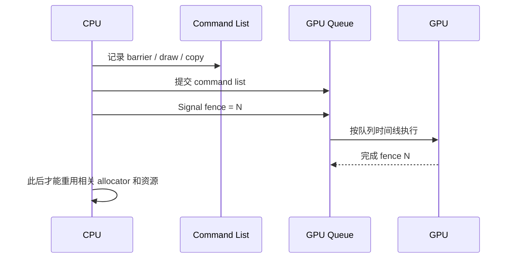

# DirectX 12 第 1 章：为什么现代图形 API 要让程序自己管理 GPU 工作

## 1. 从一个真实任务开始

实时渲染程序每秒要生成几十到几百帧。每一帧中，CPU 更新相机和游戏状态，准备绘制命令；GPU 处理顶点、光栅化三角形、计算材质、执行后处理，最后把图像交给显示系统。

如果 CPU 每提交一个 draw call 都等待 GPU 完成，二者就会轮流闲置：

```text
CPU 准备一点工作
→ 等 GPU
→ GPU 完成
→ 等 CPU 准备下一点工作
```

高效引擎必须让 CPU 和 GPU 重叠。CPU 在准备下一帧时，GPU 可能还在执行上一帧。资源上传可以在 copy queue 进行，后处理可以在 compute queue 运行，主绘制则在 graphics queue 前进。

DirectX 12 的工作，是给应用一个低开销、可多线程记录、能够明确表达这些异步关系的图形接口。它与早期高层 API 最大的区别，不是“多了几个新渲染效果”，而是把许多原来由驱动隐式完成的状态、同步和内存责任交给应用。

Microsoft 的官方说明从同一问题进入：为了提高 CPU 效率和多线程扩展，Direct3D 12 移除了旧式 immediate context，应用先记录 command lists，再提交到 command queues。[Direct3D 12 work submission](https://learn.microsoft.com/en-us/windows/win32/direct3d12/command-queues-and-command-lists)

## 2. 最直接的办法，以及它为什么不够

从程序员角度，最自然的图形 API 像一系列立即执行的函数：

```cpp
SetTexture(texture);
SetShader(shader);
Draw(mesh);
```

看起来 `Draw` 返回时，绘制应该已经完成。但 GPU 是独立设备，真正执行命令远比 CPU 调用函数晚。早期 API 和驱动会在后台检查状态、复制数据、处理 hazard，并把调用转换成 GPU 命令。

这种方式容易使用，但随着 draw call 增多，问题开始出现：

- 驱动要在每次调用时验证大量状态；
- 多个 CPU 线程难以同时修改同一个 immediate context；
- 驱动需要猜测资源何时不再被 GPU 使用；
- 应用很难明确安排 graphics、compute 和 copy 的重叠；
- 同一份检查工作可能每帧重复发生。

DX12 选择了不同方案：函数调用主要用于记录命令，记录完成后再把整批工作提交给 GPU。这样驱动不必在每个 draw call 上做同样程度的动态判断，应用也能在多个 CPU 线程并行准备命令。

代价是，应用必须真正理解异步执行。下面的代码：

```cpp
queue->ExecuteCommandLists(...);
```

只表示 CPU 已经把 command list 交给 queue，并不表示 GPU 已执行完成。如果此时覆盖 constant buffer、释放 texture 或重置仍在使用的 command allocator，GPU 会读到无效数据。

于是 DX12 的核心问题出现了：

> CPU 怎样知道 GPU 已经执行到哪里，并据此决定哪些记录内存和资源可以安全重用？

## 3. 关键想法是怎样被引出来的

为了把“记录工作”和“执行工作”分开，DX12 引入了几个职责清晰的对象。

Command list 是一份已经记录的 GPU 工作清单。里面可以包含 barrier、clear、draw、dispatch 和 copy。

Command allocator 提供记录 command list 所需的底层存储。它像记录命令时使用的纸张。command list 对象可以重新开始记录，但若 GPU 还在读取旧纸张，allocator 不能被擦除。

Command queue 是 GPU 工作时间线。应用把 command lists 提交给 queue；同一个 queue 内的工作按队列顺序前进。

Fence 是这个时间线上的完成标记。应用在提交工作后让 queue signal 一个递增值；当 fence completed value 到达该值，才证明之前的工作已经完成。



这套对象不是为了增加 API 复杂度，而是把异步系统中的四件事拆开：

```text
命令内容
记录内存
GPU 提交顺序
完成证明
```

## 4. 一步一步建立正式模型

把同一个 queue 上的工作写成：

\[
Q=(W_1,W_2,\ldots,W_n).
\]

它们在该 queue 上保持顺序。假设提交 \(W_k\) 后执行：

\[
\operatorname{Signal}(F,k).
\]

只有当：

\[
F_{\rm completed}\ge k
\]

时，CPU 才能确认 signal 之前的工作已经完成。

这解释了为什么程序通常维护多个 frame context。设最多允许 \(K\) 帧处于 flight 中：

\[
\text{frameIndex}=n\bmod K.
\]

每个 frame context 保存：

```text
command allocator
这一帧的 upload/constant buffer 区域
这一帧的临时 descriptor
提交完成时的 fence value
```

CPU 开始使用某个 context 前，检查：

\[
F_{\rm completed}
\ge
\text{context.fenceValue}.
\]

若不满足，只等待这个即将被重用的 context，而不是每一帧都让整个 GPU 空闲。

资源状态也来自同一异步模型。一个 texture 可能先被 copy queue 写入，随后作为 shader resource 读取，再作为 render target 写入。GPU 对不同用途需要不同缓存和布局。应用通过 resource barrier 声明访问阶段的转换：

```text
COPY_DEST
→ PIXEL_SHADER_RESOURCE
→ RENDER_TARGET
→ PRESENT
```

barrier 不只是“修改状态枚举”。它表达前一类访问必须怎样结束，以及后一类访问何时可以开始。

当存在多个 queue 时，单个 queue 的顺序不再足够。若 copy queue 上传 texture，graphics queue 要读取它，必须建立：

```text
copy queue 提交上传
→ copy queue signal fence N
→ graphics queue wait fence N
→ graphics queue 执行 draw
```

CPU 先调用 copy queue 再调用 graphics queue，并不能自动保证两个独立 GPU 时间线的关系。

## 5. 跟着一个完整例子走到底

考虑三帧 in-flight 的 STL 查看器。第 17 帧开始时：

\[
\text{frameIndex}=17\bmod3=2.
\]

程序取得 `frames[2]`。这个 context 上一次被第 14 帧使用，记录的 fence value 是 41。

第一步检查：

```cpp
if (fence->GetCompletedValue() < 41)
    wait_for_fence(41);
```

若 completed value 已经是 43，不需要等待；这证明第 14 帧使用的 allocator、constant buffer 区域和临时 descriptors 已经安全。

第二步重置：

```cpp
frame.allocator->Reset();
commandList->Reset(frame.allocator.Get(), initialPSO);
```

第三步记录。back buffer 初始处于 `PRESENT`，绘制前转换：

```text
PRESENT → RENDER_TARGET
```

随后 clear，绑定 root signature、PSO、vertex/index buffers，执行 draw。最后：

```text
RENDER_TARGET → PRESENT
```

第四步关闭并提交：

```cpp
commandList->Close();
queue->ExecuteCommandLists(...);
swapChain->Present(1, 0);
```

此时 GPU 可能还没完成，CPU 不能重置 `frames[2].allocator`。

第五步在 queue 时间线上插入完成点：

```cpp
uint64_t value = ++nextFenceValue; // 例如 47
queue->Signal(fence.Get(), value);
frame.fenceValue = value;
```

CPU 接着准备第 18 帧并使用 `frames[0]`。直到未来再次轮到 `frames[2]`，才检查 fence 47。

这就是 CPU 与 GPU 重叠的最小闭环：不是完全不等待，而是只在重用仍可能被 GPU 使用的资源时等待。

## 6. 回到真实系统：程序实际上怎样工作

一个可扩展的引擎不会让每个渲染 pass 自己创建 event、猜 fence 或任意 reset allocator。更合理的边界是：

```text
GraphicsDevice
├─ device 与 feature query
├─ graphics / compute / copy queues
└─ queue fences

FrameContext
├─ command allocators
├─ upload arena
├─ transient descriptor arena
└─ completion fence values

CommandContext
├─ command list
├─ resource state tracking
└─ submission metadata
```

业务层描述“这个 pass 读取 depth、写入 color”，底层系统负责转换状态和维护寿命。后续 frame graph 会把这种声明扩展到整帧，自动推导 pass 顺序、barrier 和 transient resource lifetime。

开发阶段必须开启 debug layer 和 GPU-based validation，并给 pass 添加 PIX markers。DX12 错误往往是时间相关的：资源已经在 CPU 侧释放，但 GPU 几毫秒后才访问。没有 fence 日志和 GPU capture，很容易只看到随机闪烁或 device removed。

对 CT viewer，volume upload 可能发生在 copy queue，ray marching 在 compute 或 graphics queue。新的体数据只有在上传 fence 完成后才能被采样；旧 tile 只有在最后一次渲染完成后才能回收。它们与 STL draw 使用的是同一套时间线逻辑。

## 7. 容易走错的岔路

`ExecuteCommandLists` 返回后立即释放资源，看起来合理，因为 CPU 函数已经结束。但这个函数只完成提交；真正消费者是稍后运行的 GPU。

每帧调用全局 `FlushGPU` 看起来能消除所有随机错误，也确实常常有效。它的问题是把异步管线强制变回串行，并掩盖了资源寿命设计错误。正确做法是等待具体 frame context 或具体跨队列依赖。

另一个误解是把 command list 和 allocator 当成同一个生命周期。command list 是记录接口，allocator 才拥有底层记录存储。即使 list 对象可以 reset，allocator 仍必须等 GPU 完成。

最后，resource barrier 不能被理解成让 debug layer 安静的仪式。若真实读写依赖没有表达，GPU 可能在缓存尚未可见或布局不匹配时访问资源。警告只是症状，依赖关系才是原因。

## 8. 本章落点、验证与下一章

本章从实时渲染需要 CPU/GPU 重叠这一任务出发，解释了旧式立即调用为什么会带来驱动验证和多线程扩展成本。DX12 把记录与执行分开，于是自然需要 command list、allocator、queue 和 fence。frame context 则把一帧中需要共同等待的临时资源绑定到同一个完成点。

对 STL 查看器，这一章决定 vertex/index buffer 和 constant buffer 何时可更新。对 CT 体渲染，它决定 upload、compute sampling 和 tile 回收的顺序。对游戏引擎，它是 frame graph、descriptor allocator 和 transient memory 的共同底座。

本章的 60 分钟验证是：把现有程序改成三个 `FrameContext`，每个保存 allocator、临时 constant buffer 区域和 fence value。移除每帧全局 flush，只在重用对应 context 时等待。日志同时打印 CPU frame、back-buffer index、submitted fence 和 completed fence。预期会观察到 CPU 可以领先 GPU，但绝不会提前重置仍被使用的 allocator。

下一章会追问：既然应用已经负责资源寿命，那么纹理、buffer 和 descriptor 应该怎样组织，才能既减少 CPU 绑定成本，又避免每帧重新分配？这将引出 committed/placed/reserved resources、descriptor heap、root signature 和 PSO。

