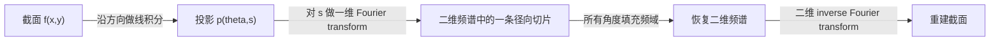

# CT 第 2 章：为什么反投影之前必须先做一次高通滤波

## 1. 从一个真实任务开始

上一章从工业零件的无损检测出发，建立了完整的理想测量链：X 射线穿过衰减分布 \(f(x,y)\)，探测器先测到强度 \(I\)，经过暗场、平场和负对数处理后，得到一组近似线积分 \(p(\theta,s)\)。现在扫描已经完成。假设设备围绕一个截面取得了 720 个角度，每个角度有 2048 个 detector samples，今天真正要完成的工作是把这些投影在几秒内恢复为一张可检查的截面。

这个任务和上一章的迭代更新不同。迭代法把重建写成反复执行 \(A\)、比较残差、再执行 \(A^\ast\)。但在几何完整、噪声适中、需要快速预览或提供迭代初值时，我们希望有一个不经过几十轮优化、直接从投影得到图像的方法。平行束二维 CT 中的 filtered backprojection，简称 FBP，就是这种解析重建的基本形式。

这里必须保留物理顺序。FBP 的输入不是原始探测器灰度，而是已经近似满足

\[
p(\theta,s)=\int_{\ell(\theta,s)} f(x,y)\,dl
\]

的线积分。若直接对强度 \(I\) 做 FBP，指数衰减还没有被线性化，后面的频域推导便不成立。

## 2. 最直接的办法，以及它为什么不够

一条投影值表示一整条射线上的总衰减。最直接的恢复办法，是把这个值沿原射线均匀“涂”回图像。对所有角度重复并求和，就得到直接反投影：

\[
b(x,y)
=
\int_0^\pi
p\!\left(\theta,x\cos\theta+y\sin\theta\right)
\,d\theta.
\]

这个做法有合理的一面。若物体中心有一个很小的高衰减点，那么每个角度的投影都在穿过该点的 detector 位置出现峰值。把所有峰值对应的射线画回去，这些射线会在真实位置相交，所以中心确实最亮。

问题是每条峰值不仅贡献给交点，也贡献给整条射线。远离真实点的位置仍会被某些角度的射线经过。角度增加会让条纹变得更均匀，却不会自动消除这种扩散。对理想点目标，直接反投影的点扩散函数近似按 \(1/r\) 衰减；结果不是一个点，而是一个中心亮、周围拖着长尾的圆形模糊。

这说明 \(A^\ast\) 不是 \(A^{-1}\)。反投影只完成了“把测量放回可能产生它的位置”，没有校正不同空间频率在这个过程里被重复累积的程度。继续增加角度能减少欠采样条纹，却不能修复这一本质上的频率失衡。

## 3. 关键想法是怎样被引出来的

要理解失衡来自哪里，先不把投影看成许多射线，而把它看成沿 detector 坐标 \(s\) 变化的一维信号。物体中缓慢变化的大块结构对应低空间频率；细小孔隙、锐利边缘对应高空间频率。问题于是可以改写为：一个角度的投影频谱，究竟保存了二维物体频谱的哪一部分？

答案是 Fourier Slice Theorem。对角度 \(\theta\) 的投影沿 \(s\) 做一维 Fourier transform，得到的并不是某个难以解释的新量，而是二维物体 Fourier transform 中穿过原点、方向为 \(\theta\) 的一条径向切片。



图中的关键不是“Fourier transform 可以重建图像”这句口号，而是径向坐标的采样密度。许多径向切片都在频域原点附近穿过，所以低频被反复覆盖；越靠近高频边缘，同样面积内能得到的样本越少。直接反投影没有补偿这种极坐标面积随半径增长的事实，因此低频被放大，图像表现为模糊。

解决方案也由此出现：在把每条投影涂回去之前，先让高频按半径得到更大的权重。这个权重就是 ramp filter 的 \(|\omega|\)。它不是为了主观“锐化”图像，而是二维频域从笛卡尔坐标改写成极坐标时必须出现的 Jacobian 补偿。

## 4. 一步一步建立正式模型

先把二维物体的 Fourier transform 记为

\[
F(\xi_x,\xi_y)
=
\int_{\mathbb R^2}
f(x,y)e^{-i2\pi(\xi_xx+\xi_yy)}\,dx\,dy.
\]

角度 \(\theta\) 的投影为

\[
p_\theta(s)
=
\int_{\mathbb R^2}
f(x,y)
\delta(s-x\cos\theta-y\sin\theta)
\,dx\,dy.
\]

现在对 detector 坐标 \(s\) 做一维 Fourier transform。这样做的目的，是检查线积分中丢掉的二维位置信息是否仍以某种频率关系保留下来：

\[
P_\theta(\omega)
=
\int p_\theta(s)e^{-i2\pi\omega s}\,ds.
\]

把投影定义代入，并利用 delta 函数令 \(s=x\cos\theta+y\sin\theta\)，得到

\[
P_\theta(\omega)
=
\int f(x,y)
e^{-i2\pi\omega(x\cos\theta+y\sin\theta)}
\,dx\,dy.
\]

与二维 Fourier transform 的定义比较便可看到：

\[
P_\theta(\omega)
=
F(\omega\cos\theta,\omega\sin\theta).
\]

这就是切片定理。一个投影的一维频谱，正好给出二维频谱的一条径向线。

接下来从二维 inverse Fourier transform 恢复 \(f\)。频域坐标改写为

\[
\xi_x=\omega\cos\theta,
\qquad
\xi_y=\omega\sin\theta.
\]

从笛卡尔面积元 \(d\xi_xd\xi_y\) 变为极坐标面积元时会出现

\[
d\xi_xd\xi_y=|\omega|\,d\omega\,d\theta.
\]

因此重建式成为

\[
f(x,y)
=
\int_0^\pi
\int_{-\infty}^{\infty}
|\omega|P_\theta(\omega)
e^{i2\pi\omega(x\cos\theta+y\sin\theta)}
\,d\omega\,d\theta.
\]

把内层 inverse Fourier transform 单独记为滤波后的投影

\[
q_\theta(s)
=
\mathcal F^{-1}
\left\{|\omega|P_\theta(\omega)\right\}(s),
\]

就得到 FBP 的程序形式：

\[
f(x,y)
=
\int_0^\pi
q_\theta(x\cos\theta+y\sin\theta)
\,d\theta.
\]

先滤波，再反投影。ramp 的高频增益会同时放大高频噪声，所以实际系统常把 \(|\omega|\) 乘上 Hann、Hamming 或 Shepp-Logan window。窗口降低噪声和振铃，代价是牺牲一部分分辨率。这不是改变 FBP 的逻辑，而是在有限采样和噪声下控制它的高频端。

## 5. 跟着一个完整例子走到底

考虑位于截面中心的一个理想小点。为了看清滤波作用，把一个角度的 detector 简化为五个等距 bin，点目标的投影写成

\[
p=[0,0,1,0,0].
\]

对这五个样本做离散 Fourier transform。由于输入是居中的单位脉冲，各个频率的幅值相同。按离散频率顺序 \(0,1,2,-2,-1\) 乘上 ramp 权重

\[
[0,1,2,2,1]
\]

再做 inverse transform，可得到一个简化的离散 ramp 响应，约为

\[
q=[-0.076,-0.524,1.200,-0.524,-0.076].
\]

它有两个值得注意的性质。第一，中心由 \(1\) 提升到 \(1.2\)，邻域出现负旁瓣；第二，所有系数之和接近零。这正是高通补偿：它不再把投影的平滑背景全部涂回，而是用邻域的负贡献抵消低频扩散。

现在取 \(0^\circ,45^\circ,90^\circ,135^\circ\) 四个角度。中心 pixel 在每个角度都采到 \(q\) 的中心值，因此累计为

\[
4\times1.2=4.8.
\]

对中心右侧一个 pixel，它在四个角度会落到不同 detector 坐标，其中只有少数接近中心，其他位置采到负旁瓣。按最近 bin 做这个玩具计算时，累计幅值远小于中心，甚至可能略为负；真实实现用线性插值、更多角度和正确归一化后，负值主要表现为有限带宽造成的轻微振铃。

若不滤波，中心和周围 pixel 都只会累积非负射线贡献，长尾无法被抵消。这个五点例子虽然没有复现连续 Ram-Lak kernel 的全部细节，却完整展示了从投影脉冲、频率加权、inverse transform 到反投影聚焦的因果过程。

## 6. 回到真实系统：程序实际上怎样工作

平行束 FBP 的实现通常沿下面的数据路径前进：

```text
raw detector frames
→ dark/flat correction
→ clamp invalid intensity
→ negative log
→ detector defect and optional scatter correction
→ zero-padding along detector direction
→ FFT
→ multiply ramp and window
→ inverse FFT
→ geometric backprojection with interpolation
→ normalization and output calibration
```

zero-padding 不能省略。FFT 实现的卷积默认是周期卷积；若不扩展 detector 信号，左端会与右端环绕连接，边界伪影会被反投影到整个截面。滤波还必须使用实际 detector spacing 构造频率轴，否则同一套代码换一个像素尺寸就会改变尺度。

程序边界可以明确拆成 `ProjectionPreprocessor`、`ProjectionFilter` 和 `Backprojector`。前者负责让数据接近线积分模型；中间模块只处理 detector 方向的频率补偿；后者负责扫描几何、插值和角度权重。这样出现伪影时，才能判断它来自物理预处理、滤波频率还是几何映射。

真实 cone-beam CT 中常用 FDK。它保留“预加权、沿 detector 滤波、三维反投影”的骨架，但会加入 cone-beam 几何距离权重。FDK 对圆轨迹 cone-beam 并不是任意条件下的精确逆变换；锥角增大、轨迹不满足充分数据条件时，会出现系统性误差。因此在工业 CT 中，FDK 很适合快速重建和初值，却不能因为速度快就忽略几何与数据完整性条件。

Kak 与 Slaney 的经典教材把切片定理、ramp filter 和 backprojection 放在同一推导中，正是因为三者不是三个可随意拼接的技巧，而是同一个 inverse Fourier integral 的不同计算步骤。[《Principles of Computerized Tomographic Imaging》](https://www.slaney.org/pct/)

## 7. 容易走错的岔路

把直接反投影的模糊归因于角度太少很容易理解，因为少角度确实会产生条纹。但即使角度连续，未滤波反投影仍然具有低频过重的 \(1/r\) 模糊；增加角度只会让错误更平滑。

在原始强度上先做 ramp filter 也看似可以节省预处理，实际却破坏了线性前提。频域切片定理连接的是衰减系数的线积分与物体频谱，不是指数形式的透射强度。

把 ramp 一直延伸到 Nyquist 频率而不考虑噪声，理论上最接近理想逆，但真实 detector 的量子噪声、点扩散和采样误差都集中影响高频。输出更“锐”不等于缺陷更可信，窗口应根据空间分辨率与噪声任务选择。

另一个常见错误是不做 padding 就直接 FFT。此时出现的边缘结构可能很像金属伪影或截断伪影，实际上只是周期卷积把 detector 两端错误连接。

最后，FBP/FDK 得到图像不代表前向模型已经被验证。可以把重建再次 forward project 并与实测投影比较。若存在稳定的结构化残差，问题可能是中心偏移、detector pose、beam hardening 或 scatter，而不是“再换一个滤波窗”就能解决。

## 8. 本章落点、验证与下一章

本章解决了上一章留下的核心问题：反投影为什么会模糊，以及一个 detector 方向的滤波为什么能够修复二维图像。切片定理说明每个投影频谱是物体二维频谱的一条径向线；极坐标面积元带来的 \(|\omega|\) 解释了 ramp filter；把滤波后的投影沿原几何反投影，就得到 FBP。

在 CT Framework 中，这一章对应投影预处理、FFT filter 和 backprojector 三个可独立验证的模块。在 CTGS 项目中，FBP/FDK 可以提供初始化或 reference volume；更重要的是，它给出了检查 Gaussian forward model 的频率视角：若重建长期缺少高频，既可能是表示尺度过大，也可能是测量预处理和采样本身限制了频带。

本章的 75 分钟验证是制作一个二维点目标或小圆盘 phantom，生成 180 个平行束投影，分别执行未滤波反投影和带 Ram-Lak/Hann 窗的 FBP。沿中心取一条 profile。预期结果是：未滤波结果具有宽而缓慢衰减的尾部；Ram-Lak 的中心最窄但噪声与振铃最明显；Hann 窗的峰稍宽而旁瓣更低。再去掉 FFT padding，应能看到 detector 边界的环绕误差进入图像。

下一章会把同一逻辑带到真实 cone-beam 采集：平行束的一条频域切片为什么不再能直接覆盖三维频谱，FDK 中的 cosine weighting、ramp filtering 和距离加权分别在补偿什么，以及圆轨迹为什么会留下无法由滤波消除的数据缺口。

