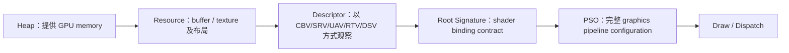

# DirectX 12 第 2 章：GPU 为什么不能直接使用一个 C++ 指针

## 1. 从一个真实任务开始

上一章已经建立了 DX12 的异步执行模型：CPU 把 command list 提交到 queue，用 fence 证明 GPU 何时完成，并通过多个 frame context 安全复用临时数据。现在我们要让一个最小 STL viewer 真正画出模型。

CPU 手中有顶点和索引数组，相机每帧产生一个 view-projection matrix，pixel shader 还可能读取材质 texture。输出是 swap chain back buffer 上的一帧图像。为了完成一次 draw，GPU 必须知道数据位于哪块显存、应该把这些 bytes 解释成 vertex、constant 还是 texture、shader 的哪个参数对应哪个对象，以及整条 graphics pipeline 使用哪些固定状态。

这就是 resource binding 的工作。它不是“在 draw 前调用几个 Set 函数”，而是把内存、数据解释、shader 接口和管线状态建立为一个在 GPU 执行期间保持有效的契约。

## 2. 最直接的办法，以及它为什么不够

从普通 C++ 经验出发，最直接的接口似乎应该是：

```cpp
SetVertexData(vertices.data());
SetCamera(&viewProjection);
SetTexture(texturePixels);
Draw();
```

这在概念上失败的第一个原因，是 CPU pointer 只在 CPU virtual address space 中有意义。独立 GPU 有自己的可访问内存和 GPU virtual address；texture 还可能使用 tiled layout、压缩和特定对齐，不能被 shader 当作普通二维 C array 任意解释。

第二个原因是异步寿命。`Draw()` 返回时 GPU 可能尚未读取这些数据。若 `vertices` 的 vector 扩容或局部变量离开作用域，CPU 地址即使曾经有效，也无法保证 GPU 稍后读取到同一内容。

第三个原因是解释方式不唯一。同一块 texture resource 可以被当作 shader resource 读取某些 mip，也可以作为 render target 写入，或用不同 format view 解释；一个 buffer 既可保存顶点，也可通过 SRV/UAV 供 compute shader 访问。只给地址不能表达 format、元素范围、mip 和访问方式。

旧式高层 API 可以在每次绑定时由驱动检查并转换这些信息。DX12 把这项工作显式化，是为了让大部分验证和管线编译提前发生，让 draw time 只提交已经组织好的对象。

## 3. 关键想法是怎样被引出来的

把问题拆开后，会出现四个不同层次。

第一层是 resource 和 backing memory。resource 描述 buffer 或 texture 的尺寸、format、mip、layout 与允许用途；heap 提供实际内存。第二层是 view，也就是 descriptor。descriptor 不复制整个资源，而是说明 shader 或 output merger 应怎样观察资源的一部分。第三层是 root signature，它规定 shader 可以从哪些 root parameters 或 descriptor tables 取得资源。第四层是 pipeline state object，简称 PSO，它把 shaders、input layout、rasterizer、blend、depth 和 render-target formats 等编译兼容状态固定下来。



这张图不是所有对象的所有权关系，而是一次 draw 获得含义的顺序。heap 回答“存在哪里”，resource 回答“这段存储是什么”，descriptor 回答“这次怎样看它”，root signature 回答“shader 从哪个槽取得它”，PSO 回答“取得后由哪套管线处理”。

## 4. 一步一步建立正式模型

先看 resource 与 heap。committed resource 为一个 resource 隐式创建专属 heap，使用简单但小资源多时开销和碎片较大。placed resource 由应用在较大的 heap 中选择 offset，适合引擎分配器和 transient aliasing。reserved resource 只保留虚拟地址范围，再按 tile 映射物理内存，适合超大虚拟纹理或稀疏资源。最小 viewer 可以从 committed resource 开始，但引擎设计要知道 resource 与 memory allocation 本来是两层。

buffer 常可通过 GPU virtual address 访问；texture 因 format、subresource 和 layout 更复杂，通常通过 descriptor。shader-visible descriptor heap 主要有两类：

```text
CBV / SRV / UAV heap
Sampler heap
```

RTV 与 DSV 也保存在 descriptor heap 中，但它们由 render-target/depth-stencil 绑定路径使用，不是普通 shader-visible table。

CBV 表示 constant buffer view，SRV 表示只读 shader resource view，UAV 表示可进行无序读写的 view。descriptor 中保存的是资源位置和解释元数据；CPU descriptor handle 用于 CPU 写入或复制 descriptor，GPU descriptor handle 才能在 command list 中作为 shader-visible table 起点。二者不能混用。

root signature 定义绑定接口。root constants 把少量 32-bit 值直接放入 root arguments；root descriptor 直接放一个 buffer GPU address；descriptor table 则放 descriptor heap 中一段范围的起点。前两者访问层次少但 root 空间有限，table 能管理大量资源且更适合材质系统。选择依据是更新频率、资源数量和硬件访问成本，而不是所有数据都使用同一种形式。

相机矩阵是一个典型 constant buffer。即使矩阵只有 64 bytes，CBV 的起始地址和大小要遵守 256-byte 对齐。每帧区域的 stride 因而应为

\[
S
=
\operatorname{AlignUp}(64,256)
=256\ \mathrm{bytes}.
\]

三帧 in-flight 时，第 \(k\) 个 frame context 使用 upload buffer 中独立的 \(256k\) 区域，避免 CPU 覆盖 GPU 仍在读取的矩阵。

最后是 PSO。graphics PSO 固定 vertex/pixel shaders、input layout、primitive topology type、rasterizer、blend、depth-stencil、sample settings、render-target/depth formats，并与 root signature 配合。DX12 要求提前创建 PSO，是因为这些状态会共同决定驱动如何编译和配置硬件。若每个 draw 临时拼接状态，昂贵验证又会回到热路径。

resource state 则描述资源当前访问方式。上传 vertex buffer 的典型路径是

```text
CPU writes upload heap
→ CopyBufferRegion to default-heap resource in COPY_DEST
→ barrier to VERTEX_AND_CONSTANT_BUFFER
→ draw reads vertex buffer
```

descriptor 不会替代 barrier。descriptor 说明“怎样看资源”，barrier 说明不同时间阶段之间的访问依赖。

## 5. 跟着一个完整例子走到底

用一个三角形走完整条路径。CPU 输入为三个带颜色顶点、三个 16-bit indices 和一个 \(4\times4\) view-projection matrix。

第一步，创建 default-heap vertex buffer 和 index buffer，初始状态为 `COPY_DEST`。再创建 upload buffer，把顶点与索引 memcpy 到 mapped address，记录 `CopyBufferRegion`。copy 完成后插入 transition：

```text
vertex buffer: COPY_DEST → VERTEX_AND_CONSTANT_BUFFER
index buffer:  COPY_DEST → INDEX_BUFFER
```

GPU 使用 `D3D12_VERTEX_BUFFER_VIEW` 取得 buffer location、总 byte size 和 stride；使用 `D3D12_INDEX_BUFFER_VIEW` 取得 location、size 和 `R16_UINT` format。这两个 view 是小型 CPU structure，并不放入 shader-visible descriptor heap。

第二步，创建一个容纳三帧矩阵的 upload resource，总大小至少 \(3\times256\) bytes。第 17 帧使用 frame index

\[
17\bmod3=2,
\]

所以 CPU 把矩阵写到 offset \(512\) 的区域。为这个区域创建 CBV，其 buffer location 为 resource GPU address 加 512，size 为 256。CBV 写入 shader-visible `CBV_SRV_UAV` heap 中属于 frame 2 的 descriptor slot。

第三步，创建 root signature。设 root parameter 0 是一个 descriptor table，包含一个映射到 shader register `b0` 的 CBV range。vertex shader 声明：

```hlsl
cbuffer Camera : register(b0)
{
    float4x4 viewProjection;
};
```

这样 shader 接口、root signature range 和 descriptor 中的 CBV 形成了一条可验证映射。

第四步，创建 PSO。input layout 声明 `POSITION` 和 `COLOR` 的格式及 byte offset；PSO 指定 vertex/pixel shader、三角形 topology type、back-buffer format、rasterizer 和 blend state。创建成功后，这套对象的兼容性在 draw 之前已经大体确定。

第五步，记录一帧 command list：

```cpp
SetGraphicsRootSignature(rootSignature);
SetDescriptorHeaps(1, &shaderVisibleHeap);
SetGraphicsRootDescriptorTable(0, frameCbvGpuHandle);
IASetVertexBuffers(0, 1, &vbv);
IASetIndexBuffer(&ibv);
IASetPrimitiveTopology(D3D_PRIMITIVE_TOPOLOGY_TRIANGLELIST);
SetPipelineState(pso);
DrawIndexedInstanced(3, 1, 0, 0, 0);
```

在此之前 back buffer 已从 `PRESENT` 转为 `RENDER_TARGET`，之后再转回 `PRESENT`。提交完成后，frame 2 的 constant-buffer 区域和 descriptor slot 必须保持不变，直到对应 fence 完成。至此，CPU 顶点数组、上传、默认显存、descriptor、root signature、PSO 和 draw 的链条全部闭合。

## 6. 回到真实系统：程序实际上怎样工作

最小三角形可以使用 committed resources 和固定 descriptors；STL viewer 或游戏引擎很快会需要明确模块：

```text
GpuAllocator
├─ committed / placed resource policy
└─ heap lifetime and residency

UploadManager
├─ staging allocation
├─ copy command recording
└─ copy fence retirement

DescriptorAllocator
├─ persistent CPU descriptors
├─ shader-visible frame ranges
└─ deferred reuse by fence

PipelineLibrary
├─ root signatures
├─ PSO keys and cache
└─ shader compatibility
```

静态 STL 顶点和索引适合上传后放在 default heap；每帧相机数据适合 upload ring；材质 texture 通过 SRV；depth texture 同时需要 DSV，并在后续 pass 中可能需要 SRV。CT volume viewer 会把体数据放入 3D texture SRV，把 transfer function 放入 1D texture SRV，compute 输出则可能通过 UAV 访问。

descriptor 本身也有 GPU lifetime。CPU 可以很快覆写 heap slot，但已提交 command list 中的 GPU handle 只是指向该 slot；若 GPU 尚未读取，覆写会让旧 draw 看到新资源。descriptor range 必须像 constant-buffer ring 一样绑定到 frame fence，或使用持久分配直到所有引用结束。

Microsoft 的 resource binding 文档把 descriptors、descriptor heaps、root signatures 和 shader registers 作为同一个绑定模型说明；PSO 文档则解释为什么大量 pipeline state 被提前聚合。[Direct3D 12 resource binding](https://learn.microsoft.com/en-us/windows/win32/direct3d12/resource-binding)

## 7. 容易走错的岔路

为每个小 buffer 创建 committed resource 最容易写，也适合原型，但大量小分配会增加内存浪费和管理成本。进入引擎后应由 allocator 把长期资源和 transient resources 分开，而不是让每个 mesh 自己决定 heap 策略。

descriptor 创建成功并不代表资源状态正确。SRV 指向一个仍处于 `COPY_DEST` 或正在被 UAV 写入的 texture，binding contract 没错，执行依赖仍然错。descriptor 与 barrier 解决的是不同维度。

另一个常见错误是混淆 CPU 与 GPU descriptor handle。CPU handle 用于 `Create*View` 和 descriptor copy；root descriptor table 需要 shader-visible heap 的 GPU handle。数值看起来都像地址，不代表可以互换。

每帧覆写同一个 CBV 所指向的 upload memory，看起来只改了 64 bytes，却违反了上一章的异步寿命。正确做法是 per-frame region 或 ring allocation，并在 fence 完成后回收。

为每个材质变化重新创建 PSO 也会把昂贵工作放回热路径。材质参数和 texture 通常通过 descriptors 改变；只有真正影响编译管线的 shader、formats 和固定状态才进入 PSO key。相反，把所有可能状态塞进一个巨大 root signature 也会增加 root argument 成本并削弱绑定约束。

## 8. 本章落点、验证与下一章

本章完成了从 C++ 数据到 GPU draw 的第一条完整资源链。heap 提供存储，resource 定义 buffer 或 texture，descriptor 定义观察方式，root signature 建立 shader binding contract，PSO 固定兼容的 graphics pipeline；resource state 和 fence 则保证这些对象在正确时间以正确方式被访问。

对 STL/DirectX 项目，这一章对应 mesh upload、per-frame camera CBV、descriptor allocation 和 PSO cache。对 CT viewer，同一结构扩展为 3D volume SRV、transfer-function SRV、UAV output 和跨 copy/graphics queue 的资源寿命。

本章的 90 分钟验证是把现有最小 DX12 程序改成正文的三角形路径：静态 vertex/index data 上传到 default heap，三个 frame context 各有独立的 256-byte camera region 和 CBV descriptor，root signature 通过 table 绑定 `b0`，PSO 在初始化时创建。每帧改变矩阵让三角形旋转。预期结果是 debug layer 与 GPU-based validation 无 resource-state、descriptor-lifetime 或 allocator-reset 报错，且移除每帧全局 GPU flush 后仍稳定运行。

下一章会从“资源越来越多”产生的新失败出发：当 depth prepass、main pass、compute postprocess 和 present 都读写同一批 resources 时，手工维护 barrier 与 lifetime 为什么迅速失控，以及 frame graph 怎样从 pass 的读写声明推导依赖、transient allocation 和跨 queue 同步。

