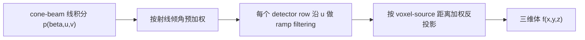

# CT 第 3 章：平板探测器为什么把 FBP 变成了 FDK

## 1. 从一个真实任务开始

上一章讨论的是二维平行束：每个角度取得一条一维投影，对 detector 坐标滤波后再反投影，就能恢复一个截面。真实工业 cone-beam CT 通常不是这样采集。一个近似点状 X 射线源发出发散射线，二维平板探测器一次记录整个投影；源和 detector 围绕零件旋转一圈，最后希望重建三维体数据。

采集链仍然从物理测量开始。对第 \(\beta\) 个角度和 detector pixel \((u,v)\)，设备先测透射强度 \(I_\beta(u,v)\)。完成暗场、平场和负对数后，数据近似为从源到该 pixel 的线积分：

\[
p_\beta(u,v)
=
-\log\frac{I_\beta(u,v)}{I_{0,\beta}(u,v)}
=
\int_{\ell(\beta,u,v)}\mu(\mathbf x)\,dl.
\]

今天的真实工作是：给定一圈这样的二维投影，怎样在可接受时间内生成三维预览体，并知道结果在哪些位置可信、在哪些位置只是圆轨迹近似？FDK 正是工业 cone-beam CT 中最常见的解析答案。

## 2. 最直接的办法，以及它为什么不够

最直接的想法是把每一行 detector 当成上一章的一维投影，对所有行分别执行 FBP，然后把得到的截面叠起来。若 cone angle 很小、物体接近旋转中心平面，这个近似可能看起来能用。

但离开中心平面后，射线不再全部位于同一个二维切片。detector 上 \(v\neq0\) 的射线同时沿轴向倾斜，一条测量穿过许多 \(z\) 层。把它强行归入某个独立截面，会把本应沿斜线分布的信息放错位置。

发散还带来两个尺度变化。第一，同一 detector pixel 对应的射线方向随 \((u,v)\) 改变，靠近平板边缘的射线相对于中央射线更倾斜，单位 detector 面积代表的立体角不同。第二，同一个 voxel 在源靠近它时投影放大，源远离它时投影缩小；若所有角度用同样权重反投影，近源视角会被错误累计。

因此，不能只把二维 FBP 在 \(v\) 方向复制。我们需要把发散几何中的采样密度改写回一个近似平行束形式，再做 detector-row 滤波，最后按 voxel 到源和 detector 的实际投影关系反投影。

## 3. 关键想法是怎样被引出来的

FDK 保留了 FBP 的核心顺序，但在滤波前后各加入一个几何补偿：



滤波仍沿 detector 横向 \(u\) 进行，因为圆轨迹在旋转平面内提供了与二维 fan-beam 类似的角度扫描。预加权把平板上的面积采样转换成更接近射线方向采样；反投影权重则补偿不同角度的放大率。

这个结构也说明 FDK 的限制。它并没有找到任意三维 cone-beam transform 的精确逆，而是把二维 fan-beam 的解析思路扩展到三维圆轨迹。圆轨迹只位于 \(z=0\) 平面，某些穿过重建体的平面并不与 source trajectory 相交，因此三维频域信息不完整。小 cone angle 时缺失影响较弱；离中平面越远、物体轴向范围越大，近似误差越明显。

## 4. 一步一步建立正式模型

建立一套常用几何。source 到旋转中心的距离记为 \(R\)，source 到 detector 的距离记为 \(D\)。在角度 \(\beta\) 时，source 位于

\[
\mathbf s_\beta
=
(R\cos\beta,R\sin\beta,0).
\]

令 detector 的横向轴随旋转切向变化，纵向轴平行于 \(z\)。对空间点 \(\mathbf x=(x,y,z)\)，先定义它相对当前中央射线方向的深度分母

\[
U_\beta(\mathbf x)
=
R-x\cos\beta-y\sin\beta.
\]

这个量越小，点越靠近 source，投影放大率越高。它在平板上的坐标可写为

\[
u_\beta(\mathbf x)
=
\frac{D(-x\sin\beta+y\cos\beta)}
{U_\beta(\mathbf x)},
\]

\[
v_\beta(\mathbf x)
=
\frac{Dz}{U_\beta(\mathbf x)}.
\]

现在先处理 detector pixel 本身的倾斜。中央射线长度方向为 \(D\)，边缘 pixel 对应的 source-detector 距离为 \(\sqrt{D^2+u^2+v^2}\)。常用 FDK 预加权为

\[
\widetilde p_\beta(u,v)
=
\frac{D}{\sqrt{D^2+u^2+v^2}}
p_\beta(u,v).
\]

接着对每个固定的 \(v\)，只沿 \(u\) 与 ramp kernel \(h\) 卷积：

\[
q_\beta(u,v)
=
(\widetilde p_\beta(\cdot,v)*h)(u),
\qquad
\mathcal F\{h\}(\omega)=|\omega|.
\]

最后，对每个 voxel 找到它在每个 view 上的 \((u_\beta,v_\beta)\)，双线性采样滤波投影，并乘放大率补偿：

\[
f_{\rm FDK}(\mathbf x)
\propto
\int_0^{2\pi}
\left(
\frac{R}{U_\beta(\mathbf x)}
\right)^2
q_\beta
\left(
u_\beta(\mathbf x),v_\beta(\mathbf x)
\right)
\,d\beta.
\]

不同文献和代码会把 \(D\)、detector spacing、角度步长及常数因子分配到不同阶段，因此公式外观可能不同。判断实现是否正确不能只逐字符比较公式，而应检查坐标定义、单位和整体归一化是否一致。

圆轨迹的根本限制可以用 Tuy 数据充分性理解：若要精确恢复一个三维区域，穿过该区域的每个相关平面都应与 source trajectory 有足够交会。单一圆轨迹无法满足所有倾斜平面，因此 FDK 在轴向高频上必然存在缺口。这不是滤波窗调参可以消除的误差。

## 5. 跟着一个完整例子走到底

取 \(R=500\ \mathrm{mm}\)、\(D=1000\ \mathrm{mm}\)，并考虑位于 \((x,y,z)=(50,0,0)\ \mathrm{mm}\) 的小缺陷。

当 source 位于 \(\beta=0^\circ\) 时，缺陷处在靠近 source 的一侧：

\[
U_0=500-50=450\ \mathrm{mm}.
\]

由于此时缺陷位于中央射线方向上，\(u_0=0\)，但反投影放大权重为

\[
\left(\frac{500}{450}\right)^2
\approx1.235.
\]

旋转到 \(\beta=90^\circ\) 时，深度分母回到

\[
U_{90}=500\ \mathrm{mm},
\]

而横向位置为

\[
u_{90}
=
\frac{1000(-50)}{500}
=-100\ \mathrm{mm}.
\]

此时权重为 1。到 \(\beta=180^\circ\) 时，缺陷位于远离 source 的一侧：

\[
U_{180}=500+50=550\ \mathrm{mm},
\]

权重下降到

\[
\left(\frac{500}{550}\right)^2
\approx0.826.
\]

三个角度看到的是同一个缺陷，但其 detector 位置和几何放大都不同。反投影时若省略 \((R/U)^2\)，近源和远源视角对 voxel 的贡献尺度不一致，重建强度会随位置发生系统偏差。

再考虑中心轴上的点 \((0,0,25)\ \mathrm{mm}\)。对所有 \(\beta\)，都有 \(U=R\)、\(u=0\)，而

\[
v=\frac{1000\times25}{500}=50\ \mathrm{mm}.
\]

它在旋转过程中沿 detector 的固定高度出现。只要 cone angle 较小，FDK 能把这些射线稳定汇聚到轴上点；但离中心平面更远时，缺失的倾斜平面数据会让轴向边缘变形。这个例子把预加权、投影坐标和反投影权重从一个输入点一直带到了 voxel 累积。

## 6. 回到真实系统：程序实际上怎样工作

工程实现可拆成四个可独立测试的模块：

```text
ConeBeamGeometry
├─ source pose per view
├─ detector origin and u/v basis
├─ pixel spacing and principal point
└─ volume world transform

ProjectionPreprocessor
→ negative log and physical corrections

FDKFilter
→ cone weight, row padding, FFT ramp/window, inverse FFT

FDKBackprojector
→ voxel projection, bilinear sample, distance weight, angle integration
```

不要在 kernel 中假设 detector 总是水平、中心永远是数组中点。几何标定通常给出每个 view 的 source、detector origin 和两个基向量；用向量形式计算 ray-plane intersection，才能支持 detector offset、tilt 和非理想轨迹。

验证顺序应从合成数据开始。先用与 FDK 不同实现路径的 forward projector 生成 point、球和带轴向边缘的 phantom，再检查位置、放大率和强度均匀性。若 forward 与 backprojector 共享同一错误坐标代码，图像可能自洽却不符合真实设备。

FDK 原始论文由 Feldkamp、Davis 和 Kress 在 1984 年提出，核心就是圆轨迹 cone-beam 的加权滤波反投影近似。[原论文](https://doi.org/10.1364/JOSAA.1.000612) 后来的 GPU 实现改变了并行方式，却没有改变其数据充分性条件。

## 7. 容易走错的岔路

把 detector 每一行独立做二维 FBP 看起来与 FDK 很接近，但它忽略了纵向发散和 voxel 随角度变化的 \(v\) 坐标。只在中心平面或极小 cone angle 下，错误才不明显。

看到边缘变暗便统一乘一个经验 radial correction，也可能让某个 phantom 更均匀，却无法替代与 \(U_\beta\) 对应的角度依赖权重。经验补偿若与几何无关，换物体位置后往往失效。

另一个误解是把 FDK 伪影全部归为噪声。圆轨迹缺失数据造成的是结构化模型误差；增加曝光只能降低量子噪声，不能补回从未采集的倾斜平面信息。

滤波仍必须在负对数线积分域进行。cone weighting 是几何采样补偿，不会把原始指数强度自动变成线积分。

最后，重建中心正确不代表整个体正确。许多几何错误在 isocenter 附近近似抵消，却随半径和 \(z\) 放大。测试 phantom 必须覆盖体积边缘，而不能只放中心球。

## 8. 本章落点、验证与下一章

本章从二维 FBP 推进到了工业 cone-beam 圆轨迹。FDK 用 detector 倾角预加权、逐行 ramp filtering 和距离加权三维反投影，近似补偿发散几何；\(U_\beta\) 同时决定 voxel 的 detector 坐标和放大率。单圆轨迹不满足完整三维数据条件，所以 FDK 的快速与稳定并不等于精确。

在 CT Framework 中，本章对应 cone-beam geometry、FDK filter 和 voxel-driven backprojector。在 CTGS 中，FDK 可作为初始化和可解释基线；若 Gaussian 方法只在远离中平面处优于 FDK，应先判断它是在利用先验补全缺失信息，还是仅改变了平滑程度。

本章的 90 分钟验证是用 point phantom 在 \(x=0\)、\(x=0.8R_{\rm FOV}\) 以及三个不同 \(z\) 位置生成 cone-beam 投影，再分别关闭预加权和反投影距离权重。预期结果是：关闭距离权重后离轴点强度随角度和位置偏移；增大 cone angle 后，即使权重正确，远离中心平面的点仍出现轴向拉伸或形状误差。

下一章会从这些无法由 FDK 权重修复的残差出发：怎样重新回到 \(y=Ax\)，把噪声、非完整数据和先验统一写入目标函数，并用迭代重建在“符合测量”与“选择一个稳定解”之间作出明确权衡。

