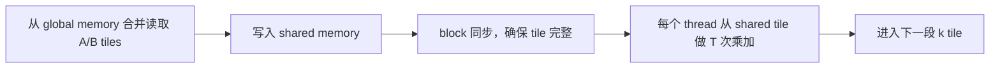

# AI Infrastructure 第 3 章：shared memory 怎样把一次读取变成多次计算

## 1. 从一个真实任务开始

上一章用 Roofline 判断逐元素 kernel 接近 DRAM 带宽屋顶，并指出真正的加速来自减少数据移动。现在面对一个计算结构不同的任务：矩阵乘、局部卷积、CT 投影中的邻域采样，或者 Gaussian tile 内多个 pixel 重复读取同一批 primitive。相邻线程需要的数据存在重叠，如果每个线程都独立从 global memory 读取，硬件带宽会被重复请求耗尽。

今天的工作是把这种“理论上可复用”变成 GPU 上的实际复用。核心手段是 tiling：一个 thread block 协作把数据 tile 搬入 shared memory，随后在 block 内多次使用。它提高的不是算法 FLOP 数，而是每个 DRAM byte 支撑的 FLOP 数，也就是 arithmetic intensity。

## 2. 最直接的办法，以及它为什么不够

以矩阵乘 \(C=AB\) 为例，最直接的 CUDA 映射让每个 thread 计算一个 \(C_{ij}\)：

\[
C_{ij}
=
\sum_{k=0}^{K-1}A_{ik}B_{kj}.
\]

thread 在循环中每次从 global memory 读取一个 \(A_{ik}\) 和一个 \(B_{kj}\)。相邻 thread 计算同一行不同列时会重复读取同一个 \(A_{ik}\)；计算不同 row 的 thread 又会重复读取同一个 \(B_{kj}\)。cache 能捕获一部分复用，但复用是否发生取决于调度、工作集和 cache 容量，程序没有明确保证。

若每个输出执行 \(K\) 次乘加，即约 \(2K\) FLOPs，同时读取约 \(2K\) 个 float，那么忽略最终写回时算术强度只有

\[
I_{\rm naive}
\approx
\frac{2K}{8K}
=0.25\ \mathrm{FLOP/byte}.
\]

这个本应计算密集的算子，因重复从 DRAM 取数而表现得像逐元素 kernel。简单增加 thread 数只能产生更多相同请求，不能创造带宽。

## 3. 关键想法是怎样被引出来的

观察一个 \(T\times T\) 的输出 tile。为了计算它在某一段 \(k\) 范围内的贡献，只需要一个 \(T\times T\) 的 \(A\) tile 和一个 \(T\times T\) 的 \(B\) tile。每个 \(A\) 元素会被同一输出行的 \(T\) 个结果复用，每个 \(B\) 元素会被同一输出列的 \(T\) 个结果复用。

shared memory 恰好是 block 内可见、由程序显式管理的低延迟存储。于是 block 可以按下面的阶段工作：

这张图中，同步不是附带成本，而是正确性边界。任何 thread 使用 shared tile 前，必须确认其他 thread 已完成加载；覆盖 tile 进入下一轮前，也必须确认上一轮所有使用已经结束。

## 4. 一步一步建立正式模型

把 \(K\) 维分成长度为 \(T\) 的阶段。一个 block 每阶段从 DRAM 读取两个 \(T\times T\) float tiles，字节数为

\[
Q_{\rm phase}
=
2T^2\times4
=8T^2\ \mathrm{bytes}.
\]

这两个 tiles 共同产生 \(T\times T\) 个输出的 \(T\) 次乘加，按一次 FMA 计 2 FLOPs：

\[
F_{\rm phase}
=
2T^3\ \mathrm{FLOPs}.
\]

所以相对于 global memory 的算术强度约为

\[
I_{\rm tiled}
=
\frac{2T^3}{8T^2}
=
\frac{T}{4}\ \mathrm{FLOP/byte}.
\]

当 \(T=16\) 时为 4 FLOP/byte；当 \(T=32\) 时为 8 FLOP/byte。tile 越大，理论复用越多，但硬件资源也随之增加。

每个 block 的 shared memory 至少需要

\[
S_{\rm block}=2T^2\times4\ \mathrm{bytes}.
\]

\(T=32\) 时为 8 KiB，看起来不大；实际高性能 kernel 常使用 double buffering、更多 staging 和每线程多个 accumulator，register 与 shared memory 会共同限制一个 SM 上能同时驻留的 blocks。

shared memory 又被划分为 banks。若同一 warp 的线程访问不同 banks，访问可以并行；若许多线程访问同一 bank 的不同地址，请求会串行化。二维数组的行跨度若与 bank 数形成不利公因子，转置访问特别容易冲突。常见修正是在 shared tile 的第二维增加一个 padding 元素，例如 `tile[T][T+1]`，改变每行起始 bank。

最后是流水化。简单版本按“加载、同步、计算、同步”串行执行。现代 CUDA 可以让下一 tile 的异步拷贝与当前 tile 计算重叠，并用多级 buffer 隐藏 global latency。但这只在基础 tile 正确、复用足够且资源未超限后才有意义。

## 5. 跟着一个完整例子走到底

考虑 \(M=N=K=4096\)，每个 block 计算一个 \(16\times16\) 的 \(C\) tile。block 中有 256 个 threads，每个 thread 负责一个输出。

朴素实现中，每个 thread 为一个输出读取 \(4096\) 个 \(A\) 和 \(4096\) 个 \(B\) 元素。一个 block 的输入流量约为

\[
256\times8192\times4
=8{,}388{,}608\ \mathrm{bytes}.
\]

block 的计算量为

\[
256\times4096\times2
=2{,}097{,}152\ \mathrm{FLOPs}.
\]

强度约为 \(0.25\) FLOP/byte。

使用 \(T=16\) tiling 后，\(K\) 方向共有

\[
4096/16=256
\]

个阶段。每阶段只加载两个 \(16\times16\) tiles，即

\[
2\times256\times4=2048\ \mathrm{bytes}.
\]

全部阶段总输入为

\[
256\times2048
=524{,}288\ \mathrm{bytes}.
\]

计算量不变，因此强度提高到

\[
2{,}097{,}152/524{,}288
=4\ \mathrm{FLOP/byte}.
\]

DRAM 输入流量减少了 16 倍，恰好对应 tile 内每个加载元素被复用约 16 次。若硬件 ridge point 为 20 FLOP/byte，这个 kernel 仍可能偏带宽侧；继续扩大 tile 或让每个 thread 计算多个输出可提高复用，但也会增加 accumulator registers。

## 6. 回到真实系统：程序实际上怎样工作

实现顺序应从一个可验证的 reference kernel 开始。先处理矩阵尺寸不是 \(T\) 倍数的边界，使用 predicated load 把越界元素填零；每阶段加载后 `__syncthreads()`，完成计算后再同步，避免下一轮覆盖仍在使用的数据。与 CPU 或 cuBLAS 结果比较通过后，再检查 profiler。

性能验证要看四类信息：global load 是否合并、shared load 是否有 bank conflicts、register 数是否导致 occupancy 下降、算术管线是否真正变忙。只看到 DRAM bytes 下降不足以证明加速；若新增同步和低 occupancy 抵消复用，时间仍可能不变。

在 CT projector 中，tile 不一定是规则矩阵块。可以让 block 处理相邻 detector pixels，使射线在体数据中访问相近区域，或把常用几何参数放入 shared/constant cache。但射线沿程分叉和三维纹理访问使复用不如 GEMM 规则，必须用 profiler 验证。

在 Gaussian rasterizer 中，一个 screen tile 的 pixels 会共同读取与该 tile 相交的 Gaussian 列表。把一批 Gaussian 参数协作加载到 shared memory，再让各 pixel threads 复用，是同一 tiling 思想；overdraw 和提前终止会让实际工作量不均匀。

## 7. 容易走错的岔路

把所有 global data 先复制到 shared memory并不一定加速。若每个元素只使用一次，复制只增加了一次写和一次读；shared memory 有价值的前提是明确复用或访问重排。

tile 越大理论 intensity 越高，但 block threads、shared memory 和 registers 都有上限。\(T=64\) 的一线程一输出 block 需要 4096 threads，本身就超过常见硬件限制。

occupancy 下降也不必然说明 kernel 变差。若每个 warp 有足够独立计算并减少了 DRAM 等待，较低 occupancy 仍可能更快。应看 achieved throughput 和 stall，而不是追求单一百分比。

shared bank conflict 与 global coalescing 是两类问题。一个布局可以让 global load 完全合并，却在 shared transpose 时发生严重 bank conflict；优化必须沿整个数据路径检查。

最后，自写 tiled GEMM 超过朴素版本不等于接近最佳。cuBLAS 还使用 register tiling、Tensor Core、流水化和架构专用调度。自写版本的价值首先是建立性能模型，而不是替代成熟库。

## 8. 本章落点、验证与下一章

本章把 Roofline 中“提高 arithmetic intensity”落实为一个具体程序结构。block 协作加载 tiles，shared memory 保存可复用数据，同步划定生产与消费阶段；\(T\times T\) tile 把理论 intensity 从约 \(0.25\) 提高到 \(T/4\) FLOP/byte。tile 大小同时受 shared memory、register、thread 数、bank conflict 和 occupancy 约束。

在 CTGS 中，这一章映射到 tile rasterizer 的 Gaussian staging；在 CT projector 中对应相邻 ray 的数据局部性；在训练基础设施中，它解释了 GEMM/attention kernel 为什么围绕分块和数据复用设计。

本章的 90 分钟验证是实现 \(16\times16\) tiled matrix multiplication，与朴素 kernel 和 cuBLAS 比较。使用非 16 倍数矩阵验证边界正确性，再记录 DRAM bytes、shared bank conflicts、registers/thread 和 runtime。预期是 tiled 版本显著减少 DRAM 事务并快于朴素版本，但仍明显慢于 cuBLAS；去掉第二个同步或错误处理边界时会出现尺寸相关错误。

下一章会从另一种资源压力进入训练系统：即使 kernel 足够快，反向传播为了保存中间 activation 仍可能耗尽显存。我们将把 autograd graph 看成带生命周期的数据流，并推导 checkpointing 如何用重复计算换取峰值显存。

