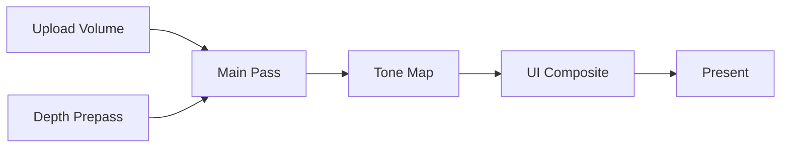

# DirectX 12 第 3 章：为什么渲染 pass 一多，手写 barrier 就会失去控制

## 1. 从一个真实任务开始

上一章已经能把 mesh、constant buffer、texture、descriptor 和 PSO 绑定成一次 draw。现在引擎不再只有一个 pass：depth prepass 写 depth，main pass 读取 depth 并写 HDR color，compute pass 做 tone mapping，UI pass 合成界面，最后 present。资源还可能由 copy queue 上传，再被 graphics queue 使用。

真实工作是让这些 passes 按正确依赖执行，插入必要而不过量的 barriers，并在资源最后一次使用后回收 transient memory。若每个 pass 自己猜测资源当前状态，它只看得到局部，无法知道前一个和后一个使用者来自哪个 queue、何时结束。

frame graph 的目标不是画一张流程图，而是把 pass 的读写意图变成可计算的依赖图，再从图中推导执行顺序、resource state、跨 queue fence 和资源生命周期。

## 2. 最直接的办法，以及它为什么不够

最直接的实现是在每个 pass 前手写 barrier：

```cpp
Transition(depth, DEPTH_WRITE, PIXEL_SHADER_RESOURCE);
Transition(hdr, RENDER_TARGET, NON_PIXEL_SHADER_RESOURCE);
```

在固定的三个 passes 中可以工作。随着可选 SSAO、shadow、debug view 和 async compute 加入，某个 pass 可能被关闭，资源的“前一状态”便改变；同一 texture 的不同 mip 还可能处于不同状态。为了安全，开发者倾向插入更多全局 barrier 或每帧 flush，性能逐渐退化。

资源分配也有同样问题。每个 pass 永久持有自己的 full-resolution texture 最容易管理，但许多中间结果只活几个 passes。4K HDR、depth、normal、motion vector 和 postprocess ping-pong 很快占用大量显存，而它们的生命周期并不全部重叠。

问题根源是 pass 只声明“我要做什么”还不够；系统还需要知道“我读写哪些资源版本”。一旦读写关系显式化，依赖和寿命就能由全局图推导，而不是靠各模块共享隐含状态。

## 3. 关键想法是怎样被引出来的

把每个 pass 看成节点，把资源的生产者到消费者连接成有向边。如果 pass B 读取 pass A 写出的资源，B 必须在 A 后；如果两个 passes 写同一资源版本，也必须有确定顺序。只读同一资源的 passes 则可以在依赖允许时并行。

资源最好使用版本概念。`HDR_v1` 是 main pass 的输出，若后续 bloom pass 写回 HDR，应产生 `HDR_v2`，而不是悄悄修改同一个名字。版本让“谁生产、谁消费”唯一化，也使没有消费者的 pass 可以被裁剪。



这张图同时包含三类信息：拓扑顺序来自数据依赖；每条边两端的访问类型决定 barrier；一个 transient resource 从生产节点活到最后消费节点，形成生命周期区间。

## 4. 一步一步建立正式模型

设 pass 集合为 \(P=\{p_0,\ldots,p_n\}\)。每个 pass 声明读取集合 \(R(p)\) 和写入集合 \(W(p)\)。若

\[
r\in W(p_i)\cap R(p_j),
\]

则存在 producer-consumer edge

\[
p_i\rightarrow p_j.
\]

write-after-read 和 write-after-write 也需要边，以保证资源版本不会在旧消费者完成前被覆盖。对有向无环图做 topological sort，就得到一个合法执行序列；若出现 cycle，说明 pass 声明或反馈结构需要显式拆成跨帧资源。

对资源 \(r\)，定义其生命周期为

\[
[t_{\rm first}(r),t_{\rm last}(r)],
\]

分别是首次生产和最后消费的 pass 序号。两个 transient resources 若生命周期不重叠，且 heap/format/alignment 条件允许，就可以使用同一段 placed-resource memory；在所有权切换处插入 aliasing barrier。

state transition 由相邻使用推导。若一个资源先作为 render target 写入，后作为 shader resource 读取，图编译器生成

```text
RENDER_TARGET → PIXEL_SHADER_RESOURCE
```

若两个 passes 都只读同一兼容状态，无需额外 transition。若 UAV 写后仍以 UAV 访问，即使 state 枚举不变，也可能需要 UAV barrier 表达前一写入对后一访问可见。

跨 queue 依赖不能只靠 resource barrier。若 copy pass 在 copy queue 写 texture，graphics pass 读取，编译结果必须包含：

```text
copy queue execute
→ copy queue signal fence N
→ graphics queue wait fence N
→ graphics pass execute
```

barrier 管同一执行依赖中的状态与可见性，fence/wait 建立不同 queue 时间线的先后。

## 5. 跟着一个完整例子走到底

构造五个 passes：

```text
P0 UploadVolume   [copy]     writes Volume
P1 DepthPrepass   [graphics] writes Depth
P2 Main           [graphics] reads Volume, Depth; writes HDR
P3 ToneMap        [compute]  reads HDR; writes LDR
P4 UIComposite    [graphics] reads LDR; writes BackBuffer
P5 Present        [graphics] reads BackBuffer
```

依赖图包含 \(P0\to P2\)、\(P1\to P2\)、\(P2\to P3\)、\(P3\to P4\)、\(P4\to P5\)。一个合法顺序是 \(P0,P1,P2,P3,P4,P5\)，但 \(P0\) 和 \(P1\) 位于不同 queues，若资源互不依赖可以重叠。

`Volume` 在 P0 结束时处于 copy destination 用途，P2 需要 SRV。系统令 copy queue signal fence 12，graphics queue 在 P2 前 wait 12，并转换到 shader resource state。`Depth` 从 P1 的 depth write 转到 P2 的 depth read。`HDR` 从 render target 转到 compute SRV；`LDR` 从 compute UAV 转到 graphics SRV，因此 P3 与 P4 之间既有 compute-to-graphics queue wait，也有相应状态转换。

生命周期为：

```text
Depth: P1 → P2
HDR:   P2 → P3
LDR:   P3 → P4
```

这三个资源的区间首尾相接而不同时被消费。若 allocation compatibility 满足，frame graph 可以让它们复用一块足够大的 transient heap，并在新 placed resource 占用同一内存时加入 aliasing barrier。即使暂时不启用 aliasing，生命周期分析也能保证资源在最后消费者完成前不被回收。

若关闭 UI pass，`LDR` 的消费者需要改为一个直接写 back buffer 的 present-copy pass，图重新编译即可。其他 pass 不需要手动改写“前一状态”。这就是声明式依赖带来的可组合性。

## 6. 回到真实系统：程序实际上怎样工作

一个最小 frame graph 通常分成 build 与 compile/execute 两阶段。build 阶段只注册 pass callback 和 resource reads/writes；compile 阶段创建版本、裁剪无输出 passes、拓扑排序、计算 lifetime、分配 transient resources、生成 barriers 与 queue sync；execute 阶段按计划录制 command lists。

模块可以划分为：

```text
FrameGraphBuilder
├─ create/import resource
├─ read/write declarations
└─ pass callbacks

FrameGraphCompiler
├─ versioning and dependency edges
├─ culling and topological sort
├─ lifetime and alias allocation
└─ barriers and queue waits

FrameGraphExecutor
├─ command list assignment
├─ descriptor realization
└─ debug markers / timestamps
```

swap-chain buffers、history buffers 和外部上传资源是 imported resources，它们的初始/最终状态及跨帧寿命由外部系统提供。transient resources 才由图完全管理。不要让 frame graph 假装拥有所有对象，否则 resize、device loss 和多帧 history 会变得含糊。

调试输出应能打印每个 pass 的 dependencies、barriers、queue、resource version 和 lifetime，并生成 PIX markers。frame graph 的价值之一，就是把原本散落在代码中的隐式状态变成可观察计划。

## 7. 容易走错的岔路

只按 pass 注册顺序执行并不是真正的 frame graph。没有读写声明，系统无法裁剪、并行、推导 barrier 或验证未初始化读取。

把资源状态存在 resource 对象的单一字段中也不够。同一 resource 的 subresources 可能不同，多个 command lists 还会并行记录；状态属于执行计划，而不是永远稳定的对象属性。

看到生命周期不重叠就直接 alias 也有风险。placed resources 仍需满足 heap type、alignment、flags 和格式兼容条件，并在切换时建立 aliasing barrier；跨帧 in-flight 还会让“本帧结束”不等于 GPU 已完成。

为追求 async compute，把所有 compute pass 放到独立 queue 也不一定加速。频繁 fence/wait、共享带宽和资源状态转换可能超过重叠收益。图提供依赖信息，是否分 queue 仍需 profiler 判断。

最后，自动 barrier 不能修复错误声明。pass 实际写 UAV 却声明只读，图会生成一份内部一致但错误的计划。debug layer、GPU validation 和资源访问审计仍然必要。

## 8. 本章落点、验证与下一章

本章把多 pass 渲染从手写状态机变成了数据依赖图。pass 的 read/write declarations 生成 producer-consumer edges；拓扑排序决定合法执行；相邻访问决定 barriers；跨 queue edge 决定 fence/wait；首次生产到最后消费决定 transient lifetime 和 aliasing 机会。

在 STL/CT viewer 中，frame graph 可管理 depth、volume ray-march target、tone mapping、UI 和 present。游戏引擎则在同一基础上扩展 shadow、G-buffer、lighting 与 temporal history。

本章的 90 分钟验证是实现只支持单 queue 的最小 frame graph：为 Depth、HDR、LDR 和 BackBuffer 声明读写，输出拓扑顺序、每个资源的 lifetime 和推导的 state transitions。预期能检测“读取前未写入”和循环依赖；关闭一个无消费者 debug pass 后，它应被自动裁剪，其他 pass 不需修改 barrier 代码。

下一章会从 CPU 提交成本继续推进：即使 frame graph 能组织 passes，场景中十万个 mesh 仍会产生十万个 draw decisions。我们将把可见性判断和 draw command 生成移到 GPU，并解释 ExecuteIndirect、argument buffer 和 GPU-driven rendering 的同步链。

