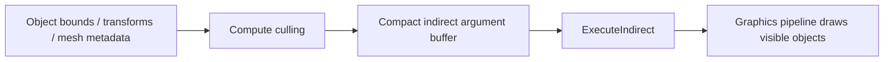

# DirectX 12 第 4 章：当场景有十万个物体时，为什么 draw decision 必须移到 GPU

## 1. 从一个真实任务开始

上一章的 frame graph 已经能组织 depth、main、postprocess 和 present passes，但 main pass 内仍可能有十万个 mesh instances。CPU 每帧遍历对象、做 frustum culling、绑定 object data，再调用 `DrawIndexedInstanced`。即使 GPU 只需绘制其中一万个，CPU 也必须检查十万个对象并提交大量命令。

今天的任务是让 GPU 读取 object bounds，自行判断可见性，生成 compact indirect command buffer，然后由 graphics queue 执行这些 commands。CPU 只提交少量 dispatch 和一次 `ExecuteIndirect`，不再逐对象决定 draw。

这就是 GPU-driven rendering 的第一层。它不意味着 CPU 完全离开渲染，而是把与大规模场景数据并行、每帧重复的 visibility 与 command generation 放到更适合吞吐处理的 GPU。

## 2. 最直接的办法，以及它为什么不够

最直接的 CPU renderer 是：

```cpp
for (const Object& obj : objects) {
    if (!frustum.Intersects(obj.bounds)) continue;
    SetObjectConstants(obj.id);
    DrawIndexedInstanced(...);
}
```

它容易调试，在对象较少时也足够快。问题随对象数量增长：CPU 要读取大量 bounds，产生分支和 cache misses；每个可见对象还要记录 root arguments 与 draw command。多线程 command recording 能分摊工作，却没有消除总工作量。

把所有 objects 合成一个巨大 vertex buffer、一次 draw 也不够。不同 mesh 的 index ranges、materials 和 transforms 不同；完全不 cull 又会让 GPU 处理大量不可见 triangles。我们需要的不是“一个 draw 画所有东西”，而是让 GPU 构造一串只包含可见对象的 draw records。

## 3. 关键想法是怎样被引出来的

DX12 的 `ExecuteIndirect` 允许 GPU 从 argument buffer 读取 draw/dispatch 参数。command signature 预先说明每条 record 包含什么，例如一个 root constant 加一个 `D3D12_DRAW_INDEXED_ARGUMENTS`。compute shader 只需把可见对象压缩写入这个 buffer，并更新 command count。



这里的关键抽象是 command 本身成为 GPU data。以前 CPU 根据 object data 生成 API calls；现在 compute shader 把 object data 转换成结构化 argument records，graphics pipeline 再消费这些 records。

## 4. 一步一步建立正式模型

先用 bounding sphere 做 frustum culling。物体中心为 \(c\)，半径为 \(r\)。视锥每个平面写成

\[
n_k^{\mathsf T}x+d_k\ge0
\]

表示内部半空间。若对任一平面有

\[
n_k^{\mathsf T}c+d_k<-r,
\]

球完全位于外部，object 可剔除；否则暂时视为可见。六个平面测试适合每 object 一个 thread。

每个可见 object 需要一个输出位置。最简单的方法是对全局 counter 做 atomic increment：

\[
j=\operatorname{atomicAdd}(count,1),
\]

然后写 `commands[j]`。command record 可以概念化为

```text
objectIndex
IndexCountPerInstance
InstanceCount
StartIndexLocation
BaseVertexLocation
StartInstanceLocation
```

command signature 告诉 `ExecuteIndirect` 先把 `objectIndex` 写入指定 root constant，再执行 indexed draw。shader 用 object index 从 structured buffer 读取 transform 和 material index。

compute pass 期间 argument buffer 与 count buffer 是 UAV。graphics 消费前必须转为

```text
INDIRECT_ARGUMENT
```

并保证 UAV writes 完成。若 culling 在 compute queue、draw 在 graphics queue，还需要 compute queue signal 与 graphics queue wait。resource state transition 不能替代跨 queue fence。

frustum culling 只删除视锥外对象。进一步的 occlusion culling 可使用前一帧或当前 depth 构建 hierarchical Z buffer。把 object screen bounds 映射到合适 mip，若其最近深度仍被 HZB 中更近深度遮挡，就可剔除。HZB 带来时序误差和保守边界，需要处理相机快速移动与新出现物体。

## 5. 跟着一个完整例子走到底

设场景有 10,000 个零件 instances，CPU 方案逐个测试后只有 1,000 个可见。每帧仍执行 10,000 次 bounds 读取与分支，并记录 1,000 组 root binding 和 draw commands。

GPU-driven 方案先把 10,000 个 `ObjectData` 和 bounds 放入 GPU structured buffer。frame graph 添加 `CullObjects` compute pass：

```text
reads:  ObjectData, FrustumPlanes
writes: IndirectArgs(UAV), DrawCount(UAV)
```

dispatch 10,000 threads。假设 object 37 可见，它通过六平面测试，atomic 得到输出位置 126，写入：

```text
objectIndex = 37
draw.IndexCountPerInstance = mesh[37].indexCount
draw.InstanceCount = 1
draw.StartIndexLocation = mesh[37].startIndex
draw.BaseVertexLocation = mesh[37].baseVertex
draw.StartInstanceLocation = 0
```

所有 threads 完成后 `DrawCount=1000`。系统对 argument/count buffers 建立 UAV completion 和 `INDIRECT_ARGUMENT` 状态，随后调用概念上的

```cpp
ExecuteIndirect(
    commandSignature,
    maxCommandCount,
    indirectArgs,
    0,
    drawCount,
    0);
```

GPU 只消费前 1,000 条 records。CPU 每帧提交的是一次 counter clear、一次 compute dispatch 和一次 indirect execution，不随可见 object 数线性增加 API calls。

若实际只有 100 个对象，atomic、buffer transition 和 indirect setup 可能比直接 CPU draw 更贵。GPU-driven 是规模化策略，不是所有场景的固定答案。

## 6. 回到真实系统：程序实际上怎样工作

工程模块可以分为：

```text
SceneGpuDatabase
├─ object transforms and bounds
├─ mesh draw metadata
└─ material indices

VisibilitySystem
├─ frustum culling
├─ optional HZB occlusion
└─ LOD selection

IndirectCommandBuilder
├─ command signature layout
├─ argument/count buffers
└─ overflow diagnostics

RenderPass
└─ ExecuteIndirect
```

argument buffer 必须预留最大 command 数，并处理 overflow。object 与 mesh metadata 更新也有寿命问题：GPU 正在读取当前 frame database 时，CPU 不能覆盖同一区域。可使用 per-frame buffers、copy queue 更新或 persistent database 加增量 patch。

material binding 需要与 indirect 模型配合。若每条 command 都切换大量 descriptors，signature 会变大且效率下降。常见设计是把 texture/material 放入大型 descriptor arrays，由 object/material index 在 shader 中间接访问；这要求清楚管理 descriptor residency 与更新寿命。

frame graph 应看到 `IndirectArgs` 和 `DrawCount` 的 UAV 写与 indirect read，从而生成 barriers 和跨 queue sync。PIX capture 中需要保留 object IDs 和 culling statistics，否则 indirect draw 出错时很难定位是哪条 record。

Microsoft 的 `ExecuteIndirect` 文档定义了 command signature、argument/count buffer 和资源状态要求，是实现时的直接接口依据。[ExecuteIndirect](https://learn.microsoft.com/en-us/windows/win32/direct3d12/indirect-drawing-and-gpu-culling-)

## 7. 容易走错的岔路

把 culling 移到 GPU 后仍由 CPU readback `DrawCount` 再决定 draw，会引入 GPU-to-CPU synchronization，抵消异步优势。count buffer 应直接由 `ExecuteIndirect` 消费。

只插入 UAV barrier、不做跨 queue fence 是常见错误。barrier 不能让 graphics queue 自动等待 compute queue 时间线。

atomic append 在高可见率下可能成为热点。更大规模系统会用 block-local compaction 和 prefix sum 减少全局 atomics，但应先用 profiler 证明 counter contention 是瓶颈。

使用前一帧 HZB 直接剔除所有遮挡对象可能造成 popping。相机移动或遮挡物移开时，新可见对象在历史 depth 中仍被判定不可见；需要 conservative bounds、velocity expansion 或周期性放宽。

最后，GPU-driven 不会自动减少 triangle 数。它减少 CPU submission 并做 object-level visibility；meshlet、LOD 和 virtual geometry 才进一步控制一个可见物体内部的几何工作。

## 8. 本章落点、验证与下一章

本章把逐对象 draw decision 从 CPU API loop 转成了 GPU data pipeline。compute shader 用 bounds 做并行 culling，把可见对象压缩成 indirect argument records；`ExecuteIndirect` 按 command signature 消费 records；UAV、`INDIRECT_ARGUMENT` 状态和跨 queue fence 共同保证生产者与消费者顺序。

在 STL assembly viewer 中，这适合大量零部件、实例和 section objects；在 CT viewer 中，可用于 brick/cluster culling；游戏引擎则可继续接入 HZB、LOD 与 material indirection。

本章的 90 分钟验证是创建 10,000 个 bounding spheres 和共享 cube mesh，用 compute shader 生成 indirect draws。记录 CPU frame time、visible count 和 GPU culling/draw time，并在相机移动时检查结果。预期是对象数量增大后 CPU recording time 比逐 draw 方案更平坦；故意省略 UAV-to-indirect 同步时 GPU validation 应报告问题或出现不稳定 commands。

下一章会进入 mesh shader 与 meshlet：object 已经可由 GPU 选择，但单个高模 mesh 的 triangle pipeline 仍以传统 index buffer 为单位。怎样把几何切成可独立 cull 的小 clusters，并在 amplification/mesh stages 中生成 primitives，将成为下一层扩展问题。

